# JSP 디렉티브 태그

디렉티브 태그는 JSP 페이지를 어떻게 처리할 것인지를 설정하는 태그입니다.<br> 
이 태그들은 JSP 페이지가 서블릿 프로그램에서 서블릿 클래스로 변환될 때 JSP 페이지와 관련된 정보를 JSP 컨테이너에 지시하는 메시지를 제공합니다.<br> 
디렉티브 태그는 JSP 페이지를 수정하여 다시 컴파일하는 경우에만 역할을 수행하며, 개별 HTML 응답에는 특별한 영향을 미치지 않습니다.

    JSP (JavaServer Pages) 디렉티브 태그는 JSP 페이지의 전체 구조와 행동을 지시하는 역할을 합니다.

    이 태그들은 JSP 엔진에게 JSP 페이지를 어떻게 처리할지 지시합니다. 

## 디렉티브 태그의 종류

JSP에서 사용되는 세 가지 주요 디렉티브 태그는 다음과 같습니다:

### 1. page 디렉티브 태그

`<%@ page ... %>`를 사용하여 JSP 페이지에 대한 정보를 설정합니다. 설정할 수 있는 정보에는 다음이 포함됩니다:

- `language`: 현재 JSP 페이지에서 사용할 프로그래밍 언어 (기본값: java)
- `contentType`: 현재 JSP 페이지의 콘텐츠 유형 (기본값: text/html)
- `pageEncoding`: 현재 JSP 페이지의 문자 인코딩 유형 (기본값: UTF-8)
- `import`: 현재 JSP 페이지에서 사용할 자바 클래스
- `session`: 현재 JSP 페이지의 HTTP 세션 사용 여부 (기본값: true)
- `buffer`: 현재 JSP 페이지의 출력 버퍼 크기 (기본값: 8KB)
- `autoFlush`: 자동으로 출력 버퍼를 비우는 것을 제어 (기본값: true)
- `isThreadSafe`: 현재 JSP 페이지에서 멀티스레드의 동작을 제어 (기본값: true)
- `info`: 현재 JSP 페이지에 대한 설명
- `errorPage`: 오류가 발생하면 이동하는 오류 페이지
- `isErrorPage`: 현재 JSP 페이지가 오류 페이지인지 여부

### 2. include 디렉티브 태그

`<%@ include ... %>`를 사용하여 JSP 페이지의 특정 영역에 다른 문서를 포함합니다.

### 3. taglib 디렉티브 태그

`<%@ taglib ... %>`를 사용하여 JSP 페이지에서 사용할 태그 라이브러리를 설정합니다.


---

### JSP page 디렉티브 속성

JSP 페이지 디렉티브는 페이지의 동작과 환경을 설정하는 데 사용되는 속성들로 구성되어 있습니다. 각 속성은 특정 기능을 제공하며, 이를 통해 페이지 처리 방식을 세밀하게 조정할 수 있습니다.

## 주요 속성

### 1. language 속성
- **설명**: 현재 JSP 페이지에서 사용할 프로그래밍 언어를 설정합니다.
- **기본값**: `java`
- **사용 예**: `<%@ page language="java" %>`

### 2. contentType 속성
- **설명**: 페이지의 MIME 타입과 문자 인코딩을 설정합니다.
- **기본값**: `text/html`
- **사용 예**: `<%@ page contentType="text/html; charset=UTF-8" %>`

### 3. pageEncoding 속성
- **설명**: 페이지의 문자 인코딩 유형을 명시합니다.
- **기본값**: `ISO-8859-1`
- **사용 예**: `<%@ page pageEncoding="UTF-8" %>`

### 4. import 속성
- **설명**: 페이지에서 사용할 Java 클래스를 임포트합니다.
- **사용 예**: 
  ```jsp
  <%@ page import="java.io.*, java.util.*" %>
  ```

### 5. session 속성
- **설명**: HTTP 세션 사용 여부를 설정합니다.
- **기본값**: `true`
- **사용 예**: `<%@ page session="true" %>`

### 6. buffer 속성
- **설명**: 출력 버퍼의 크기를 설정합니다.
- **옵션**: `none` 또는 크기(예: `8kb`)
- **사용 예**: `<%@ page buffer="8kb" %>`

### 7. autoFlush 속성
- **설명**: 출력 버퍼가 가득 찼을 때 자동으로 비우는지 여부를 설정합니다.
- **기본값**: `true`
- **사용 예**: `<%@ page autoFlush="false" %>`

### 8. isThreadSafe 속성
- **설명**: 페이지가 멀티스레드 환경에서 안전하게 동작해야 하는지 설정합니다.
- **기본값**: `true`
- **사용 예**: `<%@ page isThreadSafe="true" %>`

### 9. info 속성
- **설명**: 페이지에 대한 설명을 제공합니다.
- **사용 예**: `<%@ page info="This page displays the home screen." %>`

### 10. errorPage 속성
- **설명**: 실행 중 오류가 발생했을 때 이동할 오류 페이지의 URL을 설정합니다.
- **사용 예**: `<%@ page errorPage="errorHandler.jsp" %>`

### 11. isErrorPage 속성
- **설명**: 현재 페이지가 오류 처리 페이지인지 설정합니다.
- **기본값**: `false`
- **사용 예**: `<%@ page isErrorPage="true" %>`

### 12. isELIgnored 속성
- **설명**: Expression Language (EL) 사용 여부를 설정합니다.
- **기본값**: `false`
- **사용 예**: `<%@ page isELIgnored="true" %>`

### 13. isScriptingEnabled 속성
- **설명**: 스크립트 태그의 사용을 허용할지 설정합니다.
- **기본값**: `true`
- **사용 예**: `<%@ page isScriptingEnabled="false" %>`


---
 `isELIgnored`  사용

`04.jsp`

```jsp
<%@ page contentType="text/html;charset=UTF-8" language="java" %>
<html>
<head>
    <title>Title</title>
</head>
<body>
    <%
        request.setAttribute("RequestAttribute","request 내장 객체");
    %>
    ${requestScope.RequestAttribute}
    <script>
        const str = '문자열';
        alert(`${str} 입니다.`);
    </script>

</body>
</html>
```

<p align="center">
 
</p>

str이 출력이 되지 않는 문제가 발생.

<p align="center">
 
</p>

`<%@ page isELIgnored="true"%>`을 해주면 된다.

```jsp
<%@ page contentType="text/html;charset=UTF-8" language="java" %>
<%@ page isELIgnored="true"%>
<html>
<head>
    <title>Title</title>
</head>
<body>
    <%
        request.setAttribute("RequestAttribute","request 내장 객체");
    %>
    ${requestScope.RequestAttribute}
    <script>
        const str = '문자열';
        alert(`${str} 입니다.`);
    </script>

</body>
</html>
```

Sol1)
외부파일로 서로 변경을 하던지
무시를 하던지

---
## 2. include 디렉티브 태그
`include` 디렉티브 태그는 JSP 페이지의 특정 영역에 외부 파일의 내용을 포함하는 역할을 합니다. 이 태그를 사용함으로써 HTML, JSP, 텍스트 파일 등 다양한 유형의 파일을 현재 JSP 페이지에 통합할 수 있습니다.

## 작동 원리

서블릿 프로그램으로 번역될 때, `include` 디렉티브 태그에 의해 지정된 외부 파일의 내용이 현재 JSP 페이지와 병합되어 함께 번역됩니다. 이 방법은 머리글과 바닥글 같은 공통된 부분을 별도의 파일로 분리하여 웹 페이지를 모듈화하는 데 매우 유용합니다.

문법
```jsp
<%@ include file="파일명"%>
```
적용
```jsp
<%@ include file="header.jsp" %>
<!-- 여기에 페이지 본문 내용 -->
<%@ include file="footer.jsp" %>
```


## 주요 이점

- **코드 재사용**: 외부 파일의 내용을 현재 JSP 페이지에 동적으로 포함함으로써 코드 재사용을 촉진합니다.
- **유지 보수의 용이성**: 공통 내용을 별도의 파일에 저장함으로써, 해당 내용의 변경이 필요할 때 모든 페이지를 일일이 수정할 필요 없이 포함된 외부 파일만을 수정하면 됩니다.

### 사용 예제

예를 들어, 모든 JSP 페이지에 공통으로 포함될 머리글과 바닥글이 있다면, 이들을 별도의 JSP 파일로 만들고 다음과 같이 각 페이지에 포함시킬 수 있습니다:

`include01_header.jsp` 헤더영역 JSP
<p align="center">
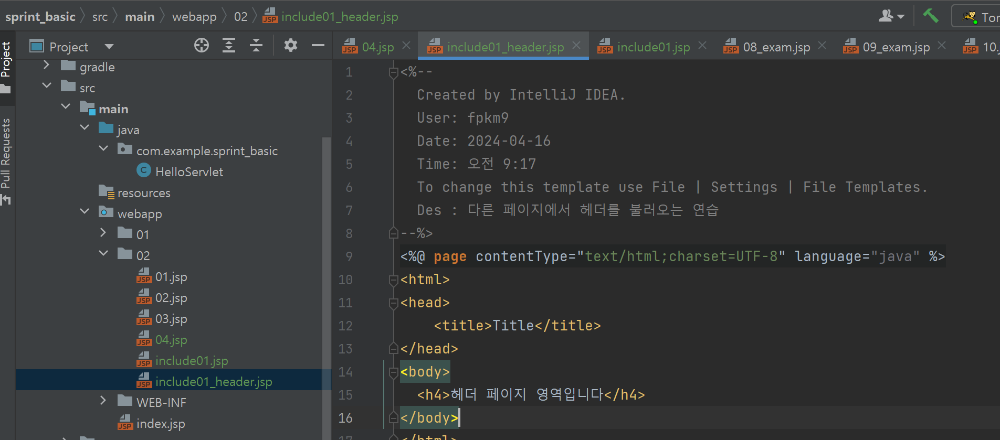
</p>

<p align="center">
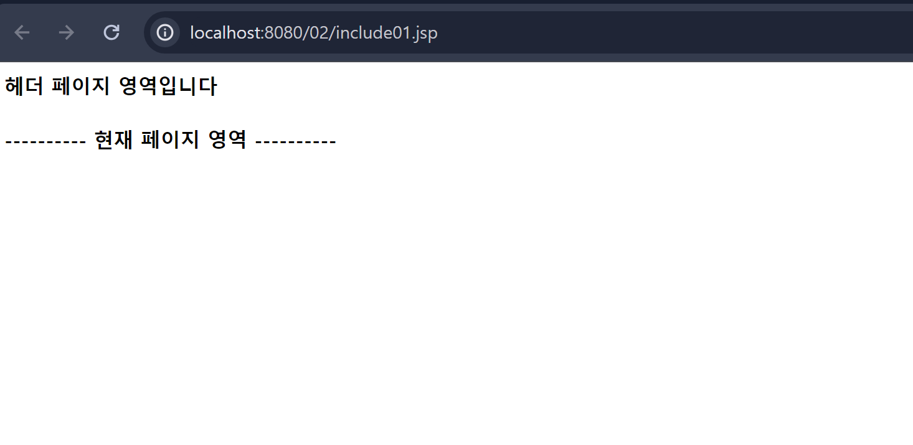
</p>


단점
<p align="center">
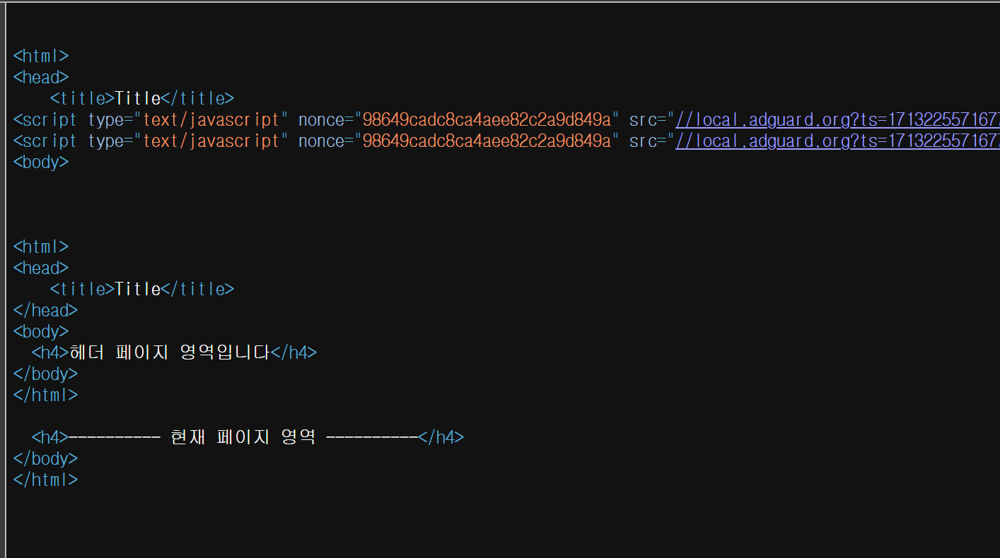
</p>

헤더영역이 2번 생성됨
그래서 include에 포함될 jsp는 필요한 태그만 남기고 다 지워줘야 함

---

연습

헤더, 푸터.jsp 파일을 만들고 `include`태그로 불러오기

`_header.jsp`
<p align="center">
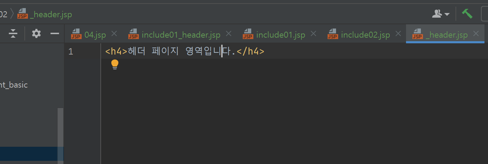
</p>

```html
<h4>헤더 페이지 영역입니다.</h4>
```

`_footer.jsp`

<p align="center">
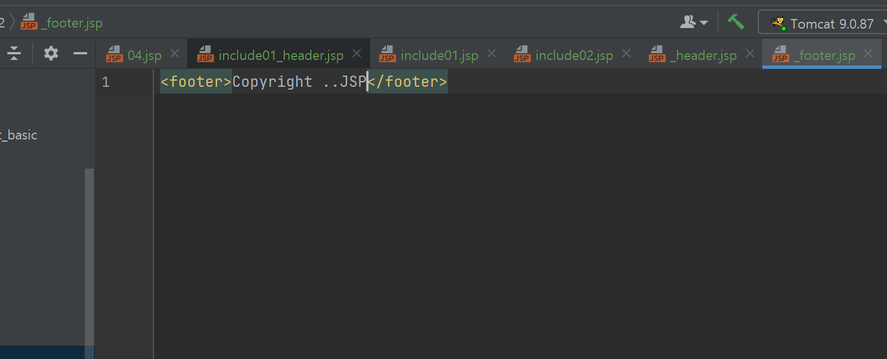
</p>

```html
<footer>Copyright ..JSP</footer>
```

`main.jsp`
<p align="center">
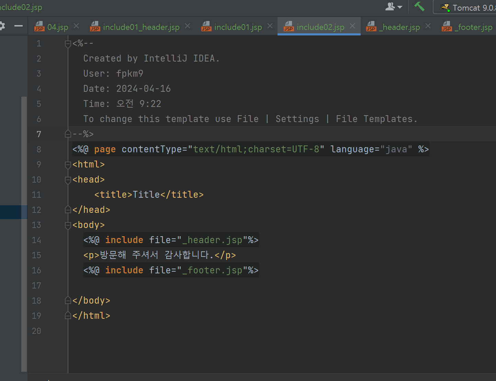
</p>
<p align="center">
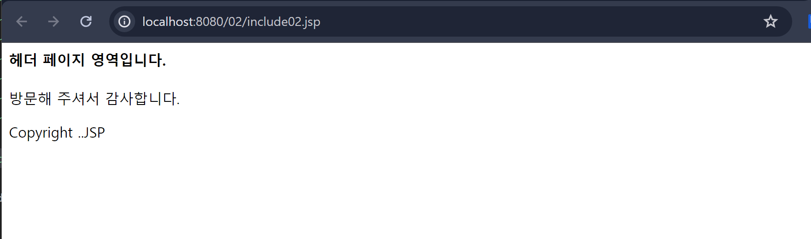
</p>

    만약 한글이 깨진다면
    1. 서버 설정에서 UTF-8로 설정
    2. 깨지는 jsp 코드에 
`<%@ page contentType="text/html;charset=UTF-8" language="java" %>` 추가하기

    <p align="center">
    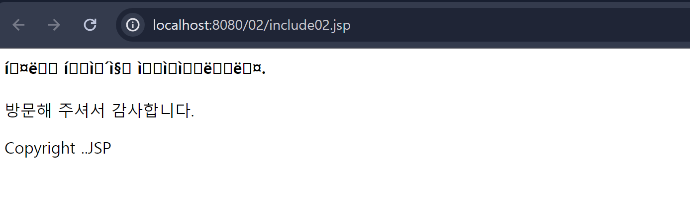
    </p>


---
## 3. taglib 디렉티브 태그
`taglib` 디렉티브 태그는 JSP 페이지에서 사용할 태그 라이브러리를 설정하는 역할을 합니다.<br> 이 디렉티브는 주로 표현 언어, JSTL(JavaServer Pages Standard Tag Library), 사용자 정의 태그(custom tags) 등을 포함할 때 사용됩니다.

## 구문

```jsp
<%@ taglib uri="경로" prefix="태그 식별자" %>
```

### 속성 설명

- `uri`: 태그 라이브러리 파일의 위치를 지정하는 경로 주소입니다. 이 경로는 태그 라이브러리의 설정 정보(TLD 파일)를 가리킵니다.
- `prefix`: 태그 라이브러리의 태그들을 JSP 페이지 내에서 식별하기 위해 사용하는 고유 이름입니다. 이 접두어를 사용하여 태그 라이브러리의 태그를 쉽게 참조할 수 있습니다.

## 역할 및 중요성

- `uri` 속성: JSP 컨테이너에 사용자가 정의한 태그 라이브러리의 위치를 알려줍니다. 이 정보를 통해 JSP 페이지가 서블릿 프로그램으로 번역될 때 필요한 태그 라이브러리를 로드할 수 있습니다.

- `prefix` 속성: JSP 페이지 내에서 사용할 태그 라이브러리의 태그를 구분하기 위한 접두어로 사용됩니다. 이 접두어를 통해 태그 라이브러리의 각 태그를 명확하게 식별하고 사용할 수 있습니다.

## 사용 예제

JSTL 코어 태그 라이브러리를 페이지에 포함시키기 위해 다음과 같이 설정할 수 있습니다:

```jsp
<%@ taglib prefix="c" uri="http://java.sun.com/jsp/jstl/core" %>
```

이 설정을 통해 `c` 접두어를 사용하여 JSTL 코어 라이브러리의 태그를 페이지 내에서 사용할 수 있습니다. 예를 들어, 조건문을 처리하는 `c:if` 태그를 사용할 때는 다음과 같이 작성합니다:

```jsp
<c:if test="${condition}">
    <!-- 조건이 참일 경우 실행할 내용 -->
</c:if>
```

사용
```jsp
<c:forEach var="k" begin="1" end="10" step="1">
    <c:out value="${k}" />
</c:forEach>
```


`taglib` 디렉티브는 JSP 페이지에서 태그를 사용하기 위한 선언적 방법을 제공하며, 코드의 재사용성과 가독성을 높여줍니다.
문법


#### jstl 라이브러리 소스

```jsp
<%@ page contentType="text/html;charset=UTF-8" language="java" %>
<%@ taglib prefix="c" uri="http://java.sun.com/jsp/jstl/core" %>

<html>
<head>
    <title>Title</title>
</head>
<body>
        <%--taglib 디렉티브 태그에 태그 라이브러리로 JSTL을 설정하는 예--%>
        <%--
        JSTL 태그
        유용한 JSP 태그의 모음인 JSTL은 자주 사용되는 핵심 기능을 제공.
        반복문, 조건문과 같은 논리적 구조 작업, XML 문서 조작, 국제화 태그 조직, SQL 조작 수행을 위한 태그를 지원.

        JTSL을 사용하려면 WebContent/WEB-INF/lib 디렉터리의 위치에 jstl.jar 라이브러리 파일이 있어야 함.
        Apache Standard Taglib 페이지에서 다운로드 가능.
        --%>
        <c:forEach var="k" begin="1" end="10" step="1">
            <c:out value="${k}" />
        </c:forEach>
</body>
</html>
```

`<%@ taglib prefix="c" uri="http://java.sun.com/jsp/jstl/core" %>`가 빨간줄이 뜬다.


외부 라이브러리 가져오기

https://mvnrepository.com/

<p align="center">
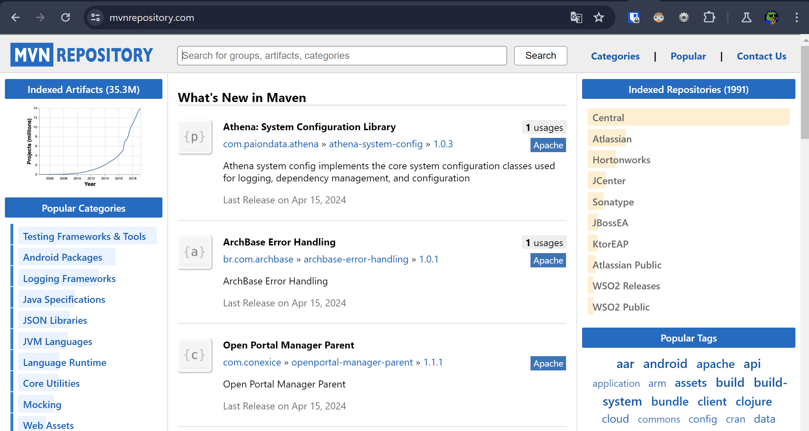
</p>
<p align="center">
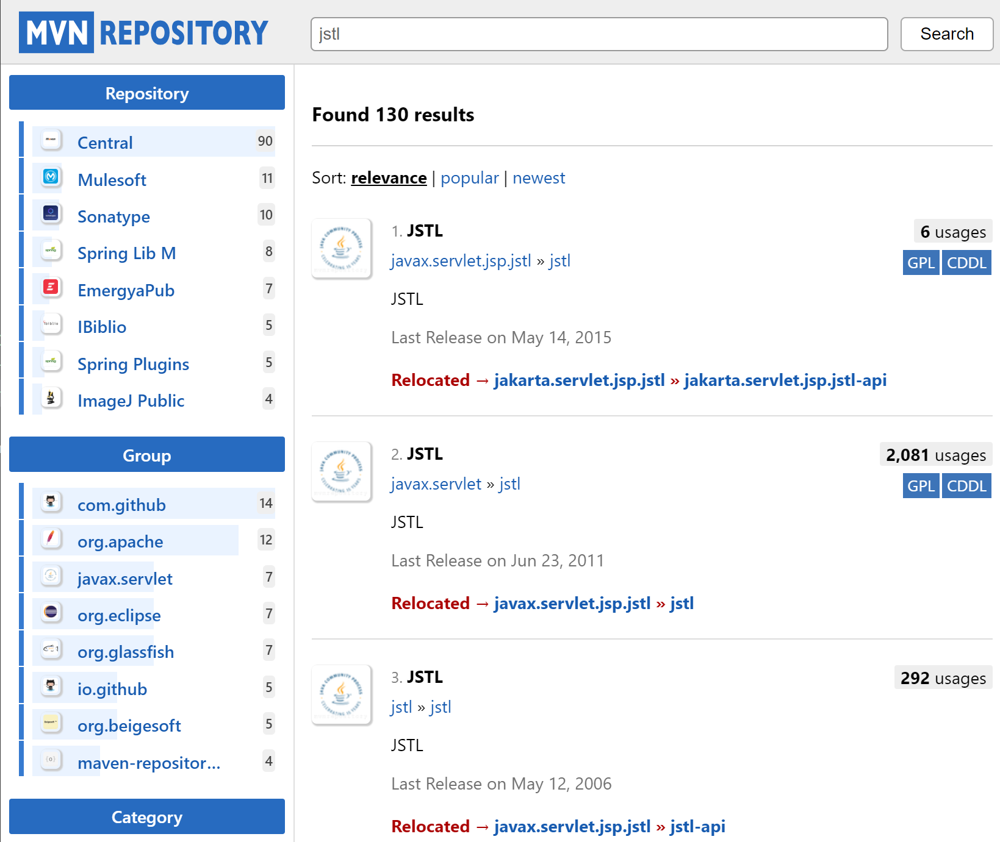
</p>

usages 가 높은 것을 선택
<p align="center">
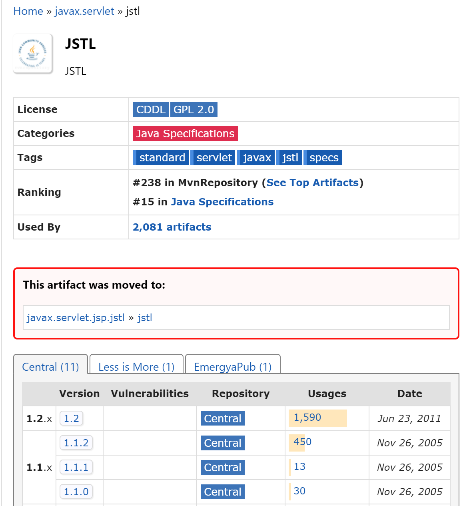
</p>
<p align="center">
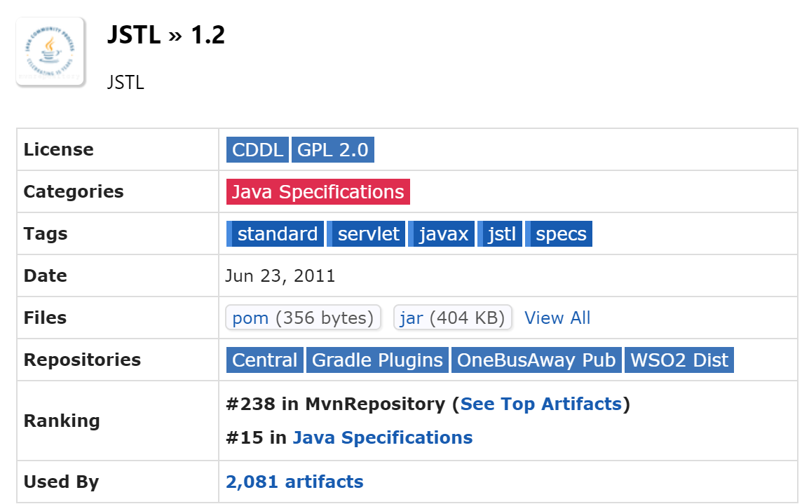
</p>

jar 파일을 다운받고 설치하는 등 여러가지 절차를 거쳐야 하는데
Gradle은 쉽다

중간에 Maven 선택되어있는것을 Gradle로 바꾸고 코드를 클릭
`built.gradle` 에 코드를 추가해주면 끝난다.

<p align="center">
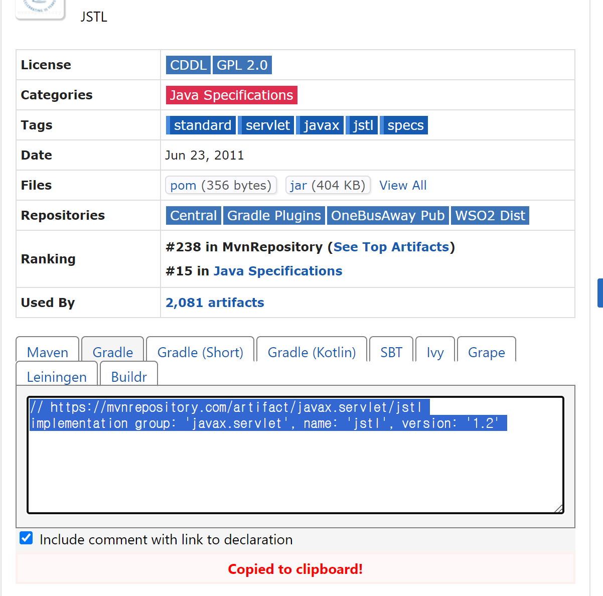
</p>

dependencies 에 복사된 코드를 붙여넣고 우측상단에 코끼리모양을 클릭해주자
그리고  실행
<p align="center">
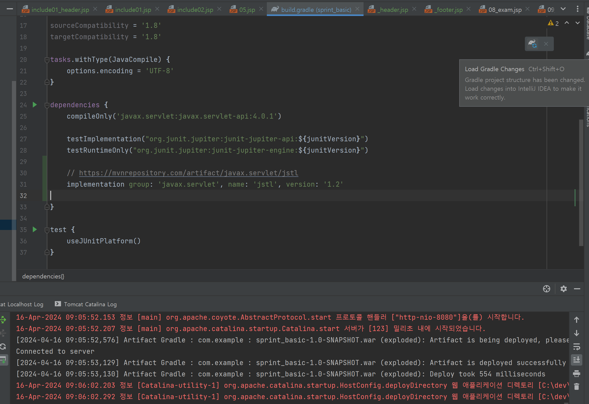
</p>

<p align="center">
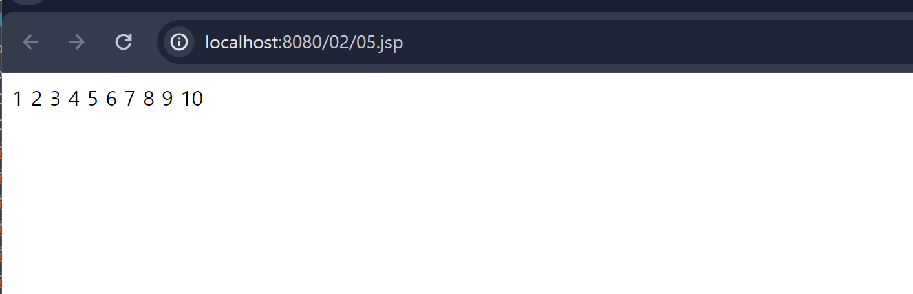
</p>

---

연습

`include.jsp`
```html
<%@ page import="java.util.Date" %><%--
  Created by IntelliJ IDEA.
  User: fpkm9
  Date: 2024-04-16
  Time: 오전 9:45
  To change this template use File | Settings | File Templates.
--%>
<%@ page contentType="text/html;charset=UTF-8" language="java" %>
<html>
<head>
    <title>Title</title>
</head>
<body>
  <%--
  2. page 디렉티브 태그를 이용하여 다음 조건에 맞게 JSP 애플리케이션을 만들고 실행 결과를 확인하시오.
  1) header.jsp 파일 생성
  <h4> 태그를 이용하여 Hello, Java Server Pages. 를 선언
  2) include.jsp 파일을 생성
  include 디렉티브 태그를 이용하여 외부파일 header.jsp 의 내용을 포함.
  java.util.Date 클래스를 이용하여 현재 시간을 출력
    --%>
  <%@ include file="_header.jsp"%>
  현재 시간 : <%= new Date()%>
</body>
</html>
```
`header.sjp`

```html
<%@ page contentType="text/html;charset=UTF-8" language="java" %>
<h4>Hello, Java Server Pages.</h4>
```

<p align="center">
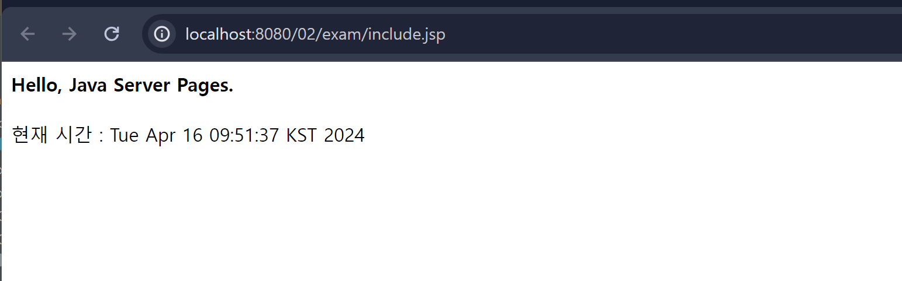
</p>


---
## JSP 내장 객체 (Implicit Objects)

JSP 내장 객체는 JSP 페이지에서 사용할 수 있도록 JSP 컨테이너에 미리 정의된 객체입니다. 이들 객체는 JSP 페이지가 서블릿 프로그램으로 번역될 때 자동으로 생성되어 사용할 수 있습니다.

## 특징

- **자동 생성**: JSP 페이지가 컴파일될 때, JSP 컨테이너는 필요한 내장 객체를 자동으로 생성하고 초기화합니다.
- **import 문 필요 없음**: 내장 객체는 import 문 없이 JSP 페이지에서 바로 사용할 수 있습니다.
- **객체 생성 및 선언 불필요**: 스크립틀릿 태그나 표현문 태그에서 별도로 선언하거나 객체를 생성하지 않고도 사용할 수 있습니다.

## 주요 내장 객체

1. **request**: 클라이언트로부터의 요청과 관련된 데이터와 기능을 제공하는 객체입니다.
2. **response**: 클라이언트에게 응답을 보낼 수 있게 하는 객체입니다.
3. **session**: 사용자의 세션을 관리하는 객체입니다.
4. **application**: 웹 애플리케이션의 전역 정보를 관리하는 객체입니다.
5. **out**: JSP 페이지의 출력을 관리하는 PrintWriter 객체입니다.
6. **config**: 서블릿 구성에 관한 정보를 제공하는 객체입니다.
7. **pageContext**: 현재 페이지의 컨텍스트 정보를 제공하는 객체입니다.
8. **page**: 현재 JSP 페이지 자신을 참조하는 객체입니다.
9. **exception**: 오류 페이지에서 예외 정보를 담는 객체입니다. (`isErrorPage`가 `true`로 설정된 페이지에서만 사용 가능)

## 사용 예

```jsp
<% 
  // session 객체를 사용하여 사용자 이름을 세션에 저장
  session.setAttribute("username", "john_doe");

  // out 객체를 사용하여 HTML 페이지에 내용 출력
  out.println("<h1>Welcome to our website!</h1>");
%>
```
JSP 내장 객체는 서블릿 프로그램으로의 번역 과정에서 자동으로 사용할 수 있도록 설정되어 있어, 개발자는 이들 객체를 통해 다양한 웹 개발 작업을 보다 효율적으로 수행할 수 있습니다.

### 내장 객체 종류

# JSP 내장 객체

JSP 내장 객체는 서블릿 환경에서 자동으로 생성되며, 각 객체는 특정 웹 개발 관련 기능을 수행합니다. 이 표는 주요 내장 객체와 그들의 반환 유형, 설명을 정리한 것입니다.

| 내장 객체 | 반환 유형                          | 설명                                                         |
|-----------|------------------------------------|--------------------------------------------------------------|
| request   | `javax.servlet.http.HttpServletRequest` | 웹 브라우저의 HTTP 요청 정보를 저장합니다.                     |
| response  | `javax.servlet.http.HttpServletResponse` | 웹 브라우저의 HTTP 요청에 대한 응답 정보를 저장합니다.          |
| out       | `javax.servlet.jsp.JspWriter`        | JSP 페이지에 출력할 내용을 담고 있는 출력 스트림입니다.         |
| session   | `javax.servlet.http.HttpSession`     | 웹 브라우저의 정보를 유지하기 위한 세션 정보를 저장합니다.      |
| application | `javax.servlet.ServletContext`       | 웹 애플리케이션의 컨텍스트 정보를 저장합니다.                   |
| pageContext | `javax.servlet.jsp.PageContext`     | JSP 페이지의 정보를 저장합니다.                                |
| page      | `java.lang.Object`                  | JSP 페이지를 구현한 자바 클래스로, JSP 페이지 자체를 나타냅니다. |
| config    | `javax.servlet.ServletConfig`       | JSP 페이지의 설정 정보를 저장합니다.                            |
| exception | `java.lang.Throwable`               | JSP 페이지에서 예외 발생을 처리합니다.                          |


각각의 내장 객체는 JSP 페이지 내에서 별도의 선언 없이 바로 사용할 수 있으며, 다양한 서블릿 및 JSP 기능을 접근하는 데 중요한 역할을 합니다.

내장 객체는 서블릿 프로그램에서 모두` _jspService()` 메소드 내부에 있음.<br>
그리고 메소드 매개변수인 request, reponse를 비롯해 pageContext, session, application, config, out, page 등은 메소드 내에
서 참조할 수 있는 참조 변수<br>
모든 내장 객체는 JSP 컨테이너가 관리하는 객체로, 이 중 request, session, application, pageContext를 이용하여 속성을 관리
할 수 있음.<br>
속성은 각각의 내장 객체가 존재하는 동안 JSP 페이지 사이에서 정보를 주고받거나 공유하는데 사용.<br>

# JSP 내장 객체 메소드

JSP 내장 객체에서 사용할 수 있는 주요 메소드들을 정리한 표입니다. 이 메소드들은 객체의 속성을 관리하는 데 사용됩니다.

| 메소드              | 반환 유형                  | 설명                                                  |
|---------------------|----------------------------|-------------------------------------------------------|
| setAttribute(String name, Object value) | `void`                  | 해당 내장 객체의 속성 이름이 `name`인 속성 값을 `value`로 저장합니다. |
| getAttribute(String name)               | `Object`                | 해당 내장 객체의 속성 이름이 `name`인 속성 값을 반환합니다. |
| removeAttribute(String name)            | `void`                  | 해당 내장 객체의 속성 이름이 `name`인 속성을 삭제합니다. |
| getAttributeNames()                     | `java.util.Enumeration` | 해당 내장 객체의 모든 속성 이름을 가져옵니다.           |

이 표는 JSP 개발자들이 내장 객체와 상호작용하는 데 사용할 수 있는 기본적인 메소드들을 제공합니다. 각 메소드는 객체의 속성을 설정, 조회, 삭제하는 역할을 합니다.


### 1. request 내장 객체의 기능과 사용법
//업데이트전
1. request 내장 객체의 기능과 사용법
웹 브라우저에서 서버의 JSP 페이지로 전달하는 정보를 저장.(request)

<p align="center">
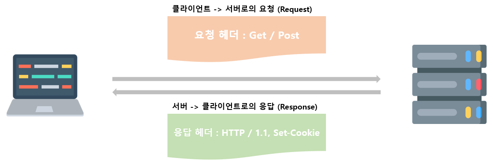
</p>
https://velog.io/@yoonsik123/TIL-45-JSP-%EB%82%B4%EC%9E%A5-%EA%B0%9D%EC%B2%B4Implicit-Object


사용

`requests01_process.jsp`
```js
<%@ page contentType="text/html;charset=UTF-8" language="java" %>
<html>
<head>
    <title>Title</title>
</head>
<body>
  <%--
  request 내장 객체로 폼 페이지에서 아이디와 비밀번호를 전송 받아 출력하기.
  1) 폼 페이지에서 입력한 한글을 처리하도록 request 내장 객체의 setCharacterEncoding() 메서드에 문자 인코딩 유형을 utf-8로 작성.
  2) 입력된 아이디와 비밀번호를 폼 문으로 부터 전송받도록 request 내장 객체의 getParameter() 메서드를 작성.
  3) 폼 문으로부터 전송받은 아이디와 비밀번호를 출력하도록 표현문 태그를 작성.
  --%>
  <%
    request.setCharacterEncoding("utf-8");
    String userid = request.getParameter("id");
    String password = request.getParameter("passwd");
  %>
    <p> 아이디 : <%=userid%></p>
    <p> 비밀번호: <%=password%></p>

</body>
</html>
```
`01.jsp`
```js
<%@ page contentType="text/html;charset=UTF-8" language="java" %>
<html>
<head>
    <title>Title</title>
</head>
<body>
  <form action="request01_process.jsp" method="post">
      <p>아 이 디 : <input type="text" name="id">
      <p> 비밀번호: <input type="text" name="passwd">
      <p> <input type="submit" value="전송" />
  </form>
</body>
</html>
```

<p align="center">
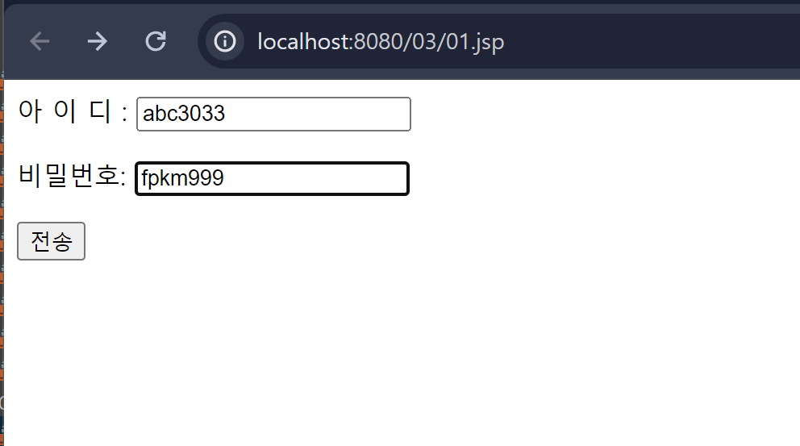
</p>

<p align="center">
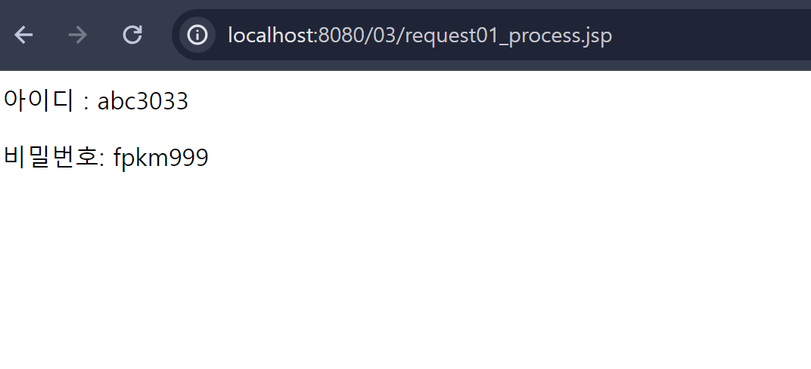
</p>

1) 요청 파라미터 관련 메소드
요청 파라미터는 사용자가 폼페이지에데이터를 입력한 후 서버에 전송할 때 전달되는 폼 페이지의 입력된 정보 형태.

2) request 내장 객체로 모든 HTTP 헤더 정보 값 출력하기.
        1) 모든 헤더 이름을 가져오도록 request 내장 객체의 getHeaderNames() 메서드를 호출하고,
        이를 모두 저장하도록 Enumeration 객체 타입의 변수 en을 작성.
        2) Enumeration 객체 타입 변수 en 의 hasMoreElements() 메서드를 통해 헤더 이름이 있을 때까지 반복하도록 while 문 작성.
        3) 현재 헤더 이름을 가져오도록 Enumeration 객체 타입 변수 en 의 nextElement() 메서드를 작성.
        4) 설정된 헤더 이름의 값을 가져오도록 request 내장 객체의 getHeader() 메소드를 작성.
```html
<%--
  Created by IntelliJ IDEA.
  User: fpkm9
  Date: 2024-04-16
  Time: 오전 10:09
  To change this template use File | Settings | File Templates.
--%>
<%@ page contentType="text/html;charset=UTF-8" language="java" %>
<html>
<head>
    <title>Title</title>
</head>
<body>  
  <form action="request01_process.jsp" method="post">
      <p>아 이 디 : <input type="text" name="id">
      <p> 비밀번호: <input type="text" name="passwd">
      <p> <input type="submit" value="전송" />
  </form>

</body>
</html>
```
<p align="center">
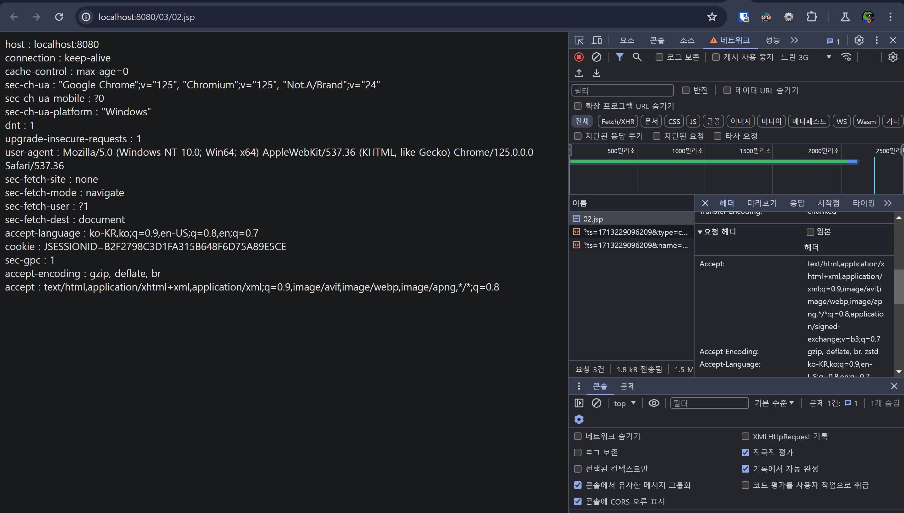
</p>


---
#### request 내장 객체로 모든 웹 브라우저 및 서버 정보 값 출력하기

```jsp
<%@ page contentType="text/html;charset=UTF-8" language="java"%>
<html>
<head>
    <title>Title</title>
</head>
<body>
  <%--
   request 내장 객체로 모든 웹 브라우저 및 서버 정보 값 출력하기
   --%>
  <%-- 웹 브라우저의 IP 주소 반환 --%>
  <p>클라이언트 IP : <%=request.getRemoteAddr()%>


      <%-- 웹 브라우저의 요청 정보 길이 반환 --%>
  <p>요청 정보 길이 : <%=request.getContentLength() %>

      <%-- 웹 브라우저의 요청 정보 인코딩 반환 --%>
  <p>요청 정보 인코딩 : <%=request.getCharacterEncoding() %>

      <%-- 웹 브라우저의 요청 정보 콘텐츠 유형 반환 --%>
  <p>요청 정보 콘텐트 유형 : <%=request.getContentType() %>

      <%-- 웹 브라우저의 요청 정보 프로토콜 반환 --%>
  <p>요청 정보 프로토콜 : <%=request.getProtocol() %>

      <%-- 웹 브라우저의 요청 정보 방식 (GET, POST)을 반환 --%>
  <p>요청 정보 전송방식 : <%=request.getMethod() %>

      <%-- 웹 브라우저에 요청한 URI 경로를 반환 --%>
  <p>요청 URI : <%=request.getRequestURI() %>

      <%-- 현재 JSP 페이지의 웹 애플리케이션 콘텍스트 경로를 반환 --%>
  <p>컨텍스트 경로 : <%=request.getContextPath() %>

      <%-- 서버 이름을 반환 --%>
  <p>서버 이름  : <%=request.getServerName() %>

      <%-- 실행 중인 서버 포트 반환 --%>
  <p>서버 포트  : <%=request.getServerPort() %>

      <%-- 웹 브라우저의 전체 요청 파라미터 문자열(쿼리문) 반환 --%>
  <p>쿼리문  : <%=request.getQueryString() %>
</body>
</html>
```

<p align="center">
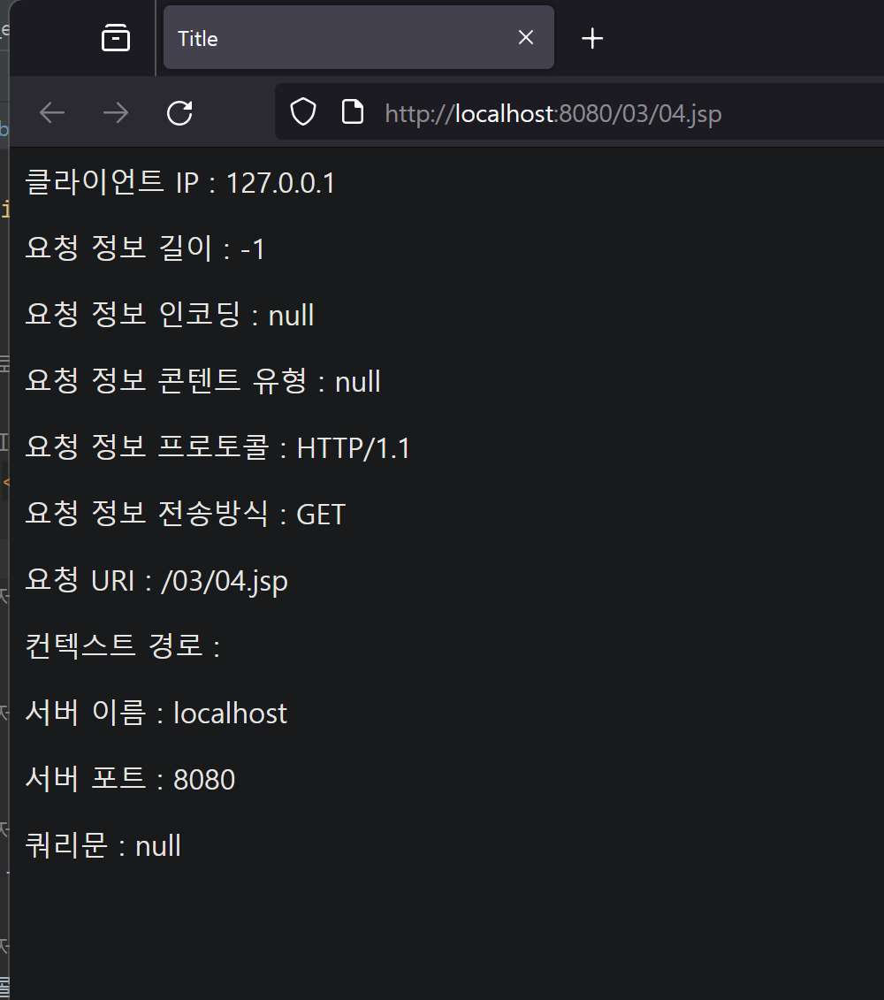
</p>

---

### 2. response 내장 객체의 기능과 사용법
리퀘 : 사용자의 어떠한 입력값이 서버로 전송되는 행위
리스폰스 :  사용자의 응답에 대한 결과를 전달하는 행위
respone 내장 객체는 사용자의 요청을 처리한 결과를 서버에서 웹 브라우저로 전달하는 정보를 저장. 즉 서버는 응답 헤더와 요청 처리 결과 데이터를 웹브라우저로 보냄

#### 1) 페이지 이동 관련 메소드 
사용자가 새로운 페이지를 요청할 때와 같이 **페이지를 강제로 이동하는 것을 리다이렉션(redirection).**

    * 페이지 이동 방법
    1. 포워드(forward) 방식
    content...
    2. 리다이렉트 (redirect) 방식
    content...

실습

`response01_process.jsp`
```jsp
<%@ page contentType="text/html;charset=UTF-8" language="java" %>
<html>
<head>
    <title>Title</title>
</head>
<body>
    <%--
    내장 객체로 페이지 이동하기
    아이디와 비밀번호가 일치하면 성공 페이지로, 그렇지 않으면 로그인 페이지로 이동.

    1. 폼 문으로 전송받은 아이디와 비밀번호가 일치하면 response01_success.jsp 페이지로 이동,
    일치하지 않으면 response01_jsp 페이지로 이동하도록
    response 내장 객체의 sendRedirect() 메서드를 작성
        --%>
<%
    request.setCharacterEncoding("utf-8");
    String userid = request.getParameter("id");
    String password = request.getParameter("passwd");

    if (userid.equals("관리자") && password.equals("1234")) {
        out.println("로그인을 성공했습니다!!");
        response.sendRedirect("response01_success.jsp");
    } else {
        out.println("로그인을 실패했습니다.");
        response.sendRedirect("response01_failed.jsp");
    }
%>
<p> 아이디 : <%=userid%></p>
<p> 비밀번호: <%=password%></p>

</body>
</html>
```


로그인 성공
<p align="center">
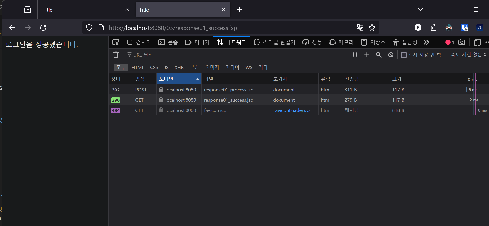
</p>

로그인 실패
<p align="center">
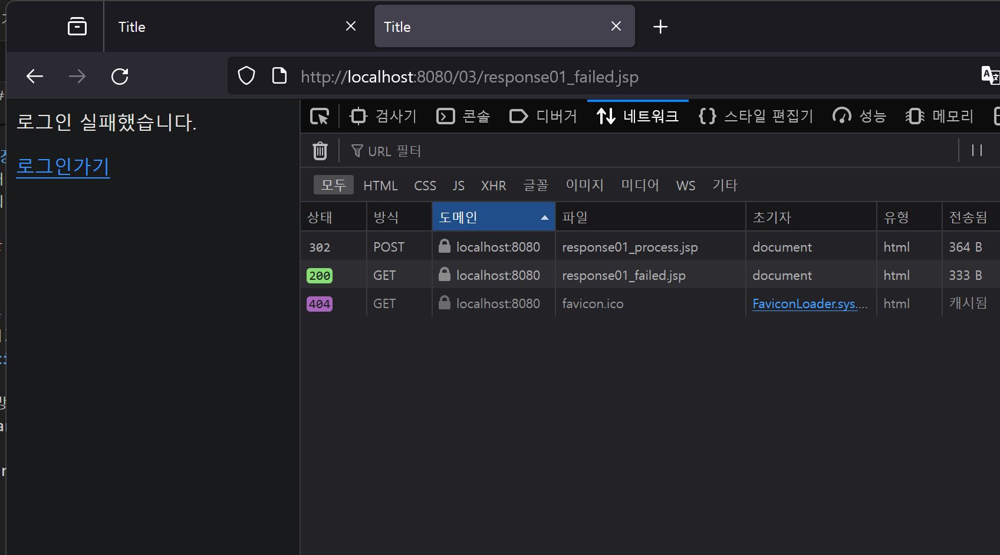
</p>

<p align="center">
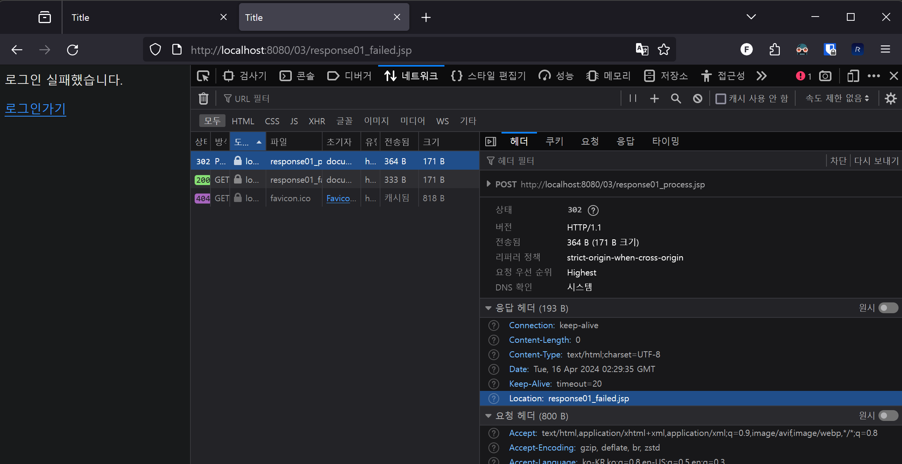
</p>
location값이 있다면(sendRedirection가 있다면)
해당 페이지를 로딩한다

---

`request.jsp`
```js
<%@ page contentType="text/html;charset=UTF-8" language="java" %>
<html>
<head>
    <title>Title</title>
</head>
<body>
  <form action="response01_process.jsp" method="post">
    <p> 아 이 디 : <input type="text" name="id">
    <p> 비밀번호 : <input type="text" name="passwd">
    <p> <input type="submit" value="전송">
  </form>

</body>
</html>
```

`response01_process.jsp`
```js
<%
    request.setCharacterEncoding("utf-8");
    String userid = request.getParameter("id");
    String password = request.getParameter("passwd");

    if (userid.equals("관리자") && password.equals("1234")) {
        out.println("로그인을 성공했습니다!!");
        response.sendRedirect("response01_success.jsp");
    } else {
        out.println("로그인을 실패했습니다.");
        response.sendRedirect("response01_failed.jsp");
    }
%>
<p> 아이디 : <%=userid%></p>
<p> 비밀번호: <%=password%></p>

</body>
</html>

```

`success.jsp`
```js
<%@ page contentType="text/html;charset=UTF-8" language="java" %>
<html>
<head>
    <title>Title</title>
</head>
<body>
  로그인을 성공했습니다.
</body>
</html>
```

`failed.jsp`
```js
<%@ page contentType="text/html;charset=UTF-8" language="java" %>
<html>
<head>
    <title>Title</title>
</head>
<body>
    로그인 실패했습니다.
    <p><a href="./response01.jsp">로그인가기</a>
</body>
</html>
```


---

##### 연습. 웹 페이지 자동 새로고침 (5초마다)
    response 내장 객체로 5초마다 JSP 페이지 갱신하기
    1) 5초마다 JSP 페이지가 갱신되도록 response 내장 객체의 setIntHeader()  메서드를 작성.
    2) 5초마다 JSP 페이지가 갱신된 시간을 출력하도록 표현문 태그 작성.


소스코드
```html
<%@ page contentType="text/html;charset=UTF-8" language="java" %>
<html>
<head>
    <title>Title</title>
</head>
<body>
  <p>이 페이지는 5초마다 새로고침 됩니다.</p>
  <%
    response.setIntHeader("Refresh",5);
  %>
  <p> <%=(new java.util.Date())%></p>

</body>
</html>
```

<p align="center">
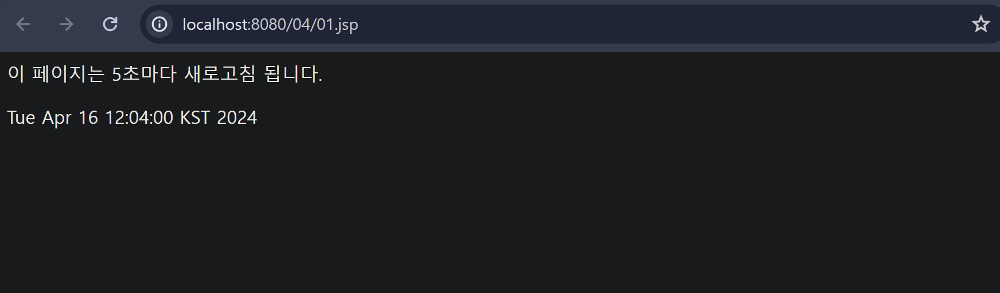
</p>
---

##### 연습. 웹 페이지를 통해 현재 시간을 사용자에게 보여주기
<B>조건</B>
1. **Java와 HTML의 통합**: JSP(Java Server Pages) 기술을 사용하여 `response.jsp` 파일에 작성
2. **자동 페이지 새로고침**: 브라우저에게 매 5초마다 페이지를 자동으로 새로 고침
3. **시간 표시**: `Calendar` 클래스를 사용하여 현재 시각을 가져오고, 오전/오후(AM/PM) 포맷으로 변환하여 페이지에 표시
4. **싱글톤 패턴 사용**: `Calendar.getInstance()`는 Calendar 클래스의 인스턴스를 싱글톤 패턴을 사용하여 생성합니다. 
ETC)이는 `new` 키워드를 사용하지 않고도 객체에 접근할 수 있게 해줍니다.

>요약
>
>5초마다 자동으로 새로 고침되는 웹 페이지를 제공, 페이지에는 현재 시간이 오전/오후 형식으로 실시간으로 업데이트되어 표시됩니다.
*12시에는 PM이면서 12:XX 로 표기되어야 함

```jsp
<%@ page import="java.util.Calendar" %>
<%@ page contentType="text/html;charset=UTF-8" language="java" %>
<html>
<head>
    <title>Title</title>
</head>
<body>
<%
    response.setIntHeader("Refresh", 5);
    Calendar calendar = Calendar.getInstance();
    // getInstance -> 싱글톤 패턴 new 을 안씀
    String am_pm;
    int hour = calendar.get(Calendar.HOUR_OF_DAY);
    int minute = calendar.get(Calendar.MINUTE);
    int second = calendar.get(Calendar.SECOND);

    if (hour < 12) {
        am_pm = " AM";
    } else {
        am_pm = " PM";
        if (hour != 12) {
            hour = hour - 12;
        }
    }
    String currentTime = hour + ":" + minute + ":" + second + am_pm;
%>
<p>현재 시간은 <b><%=currentTime %>
</b></p>
</body>
</html>
```
<p align="center">

</p>

개발자 도구로 `Refresh` 값도 확인가능하다.
<p align="center">
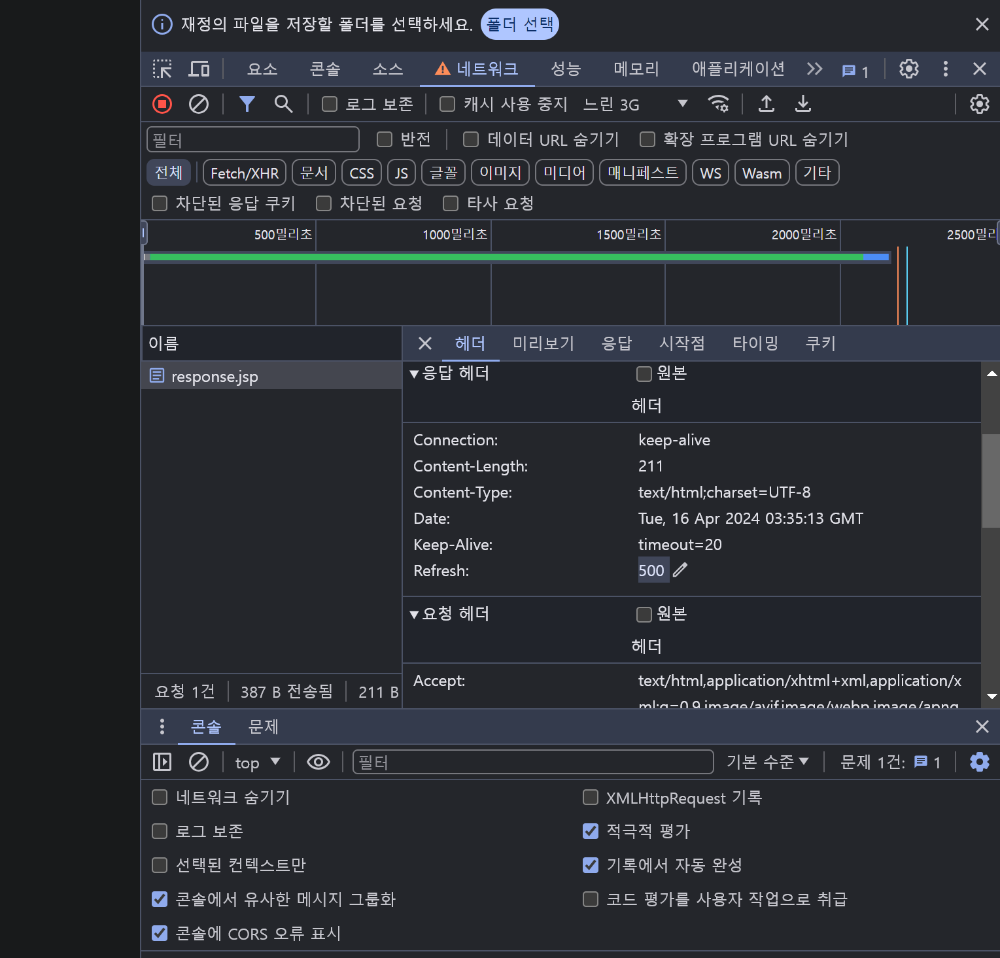
</p>

---

##### 연습. 위코드 + 구글 검색페이지로 이동되는 기능 추가(리다이렉트)


**목적**: 웹 페이지에 현재 시간을 표시하고, 사용자가 링크를 클릭하면 다른 페이지(구글 홈페이지로의 리다이렉션을 수행하는 JSP 페이지)로 이동할 수 있도록 구현

**사용된 기술 및 특징**:
- **자동 새로고침**: `response.setIntHeader("Refresh", 5);`를 사용하여 페이지를 5초마다 자동으로 새로 고침합니다.
- **시간 계산**: `Calendar` 클래스를 사용하여 현재 시간을 계산하고 오전/오후로 구분하여 표시합니다.
- **링크 제공**: 사용자가 클릭할 수 있는 하이퍼링크(`<a>` 태그)를 제공하여 다른 페이지로의 이동을 가능하게 합니다.
- **리다이렉션**: `response.sendRedirect("https://www.google.com");`을 사용하여, 해당 페이지에 접속하는 모든 사용자를 구글 홈페이지로 리다이렉션한다.


`response.jsp`
```html
<%@ page contentType="text/html;charset=UTF-8" language="java" %>
<html>
<head>
    <title>Title</title>
</head>
<body>
<%
    response.setIntHeader("Refresh", 5);
    Calendar calendar = Calendar.getInstance();
    // getInstance -> 싱글톤 패턴 new 을 안씀
    String am_pm;
    int hour = calendar.get(Calendar.HOUR_OF_DAY);
    int minute = calendar.get(Calendar.MINUTE);
    int second = calendar.get(Calendar.SECOND);

    if (hour < 12) {
        am_pm = " AM";
    } else {
        am_pm = " PM";
        if (hour != 12) {
            hour = hour - 12;
        }
    }
    String currentTime = hour + ":" + minute + ":" + second + am_pm;
%>
<p>현재 시간은 <b><%=currentTime %>
    <p><a href="./response_data.jsp">구글 홈페이지로 이동하기</a></p>
</b></p>
</body>
</html>
```

`response_data.jsp`
```html
<%@ page contentType="text/html;charset=UTF-8" language="java" %>
<%
    response.sendRedirect("https://www.google.com");
%>
```
<p align="center">
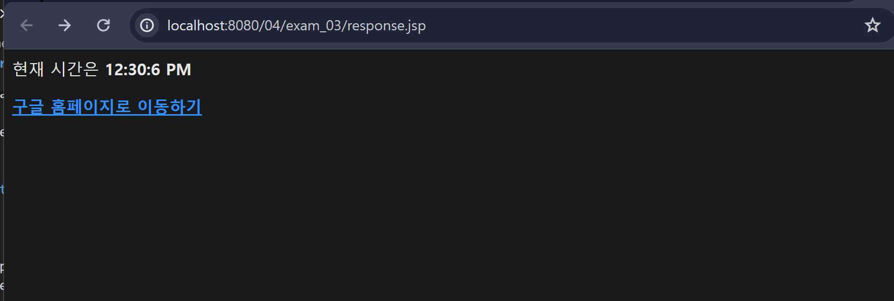
</p>
<p align="center">

</p>

---
참고
- https://pathas.tistory.com/179