JSP 표현 언어

12) isELIgnored 

04.jsp

```html
<%--
  Created by IntelliJ IDEA.
  User: fpkm9
  Date: 2024-04-16
  Time: 오전 9:04
  To change this template use File | Settings | File Templates.
--%>
<%@ page contentType="text/html;charset=UTF-8" language="java" %>
<html>
<head>
    <title>Title</title>
</head>
<body>
    <%
        request.setAttribute("RequestAttribute","request 내장 객체");
    %>
    ${requestScope.RequestAttribute}
    <script>
        const str = '문자열';
        alert(`${str} 입니다.`);
    </script>

</body>
</html>
```

<p align="center">
 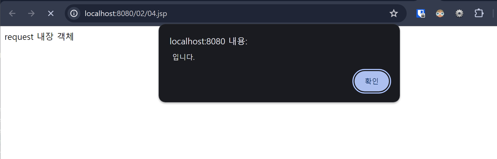
</p>

str이 출력이 되지 않는 문제가 발생.

<p align="center">
 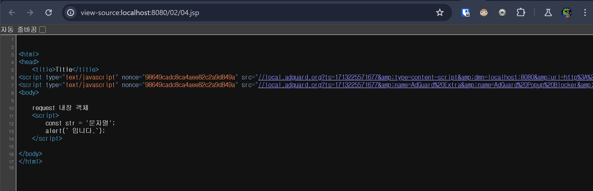
</p>

`<%@ page isELIgnored="true"%>`을 해주면 된다.

```html
<%@ page contentType="text/html;charset=UTF-8" language="java" %>
<%@ page isELIgnored="true"%>
<html>
<head>
    <title>Title</title>
</head>
<body>
    <%
        request.setAttribute("RequestAttribute","request 내장 객체");
    %>
    ${requestScope.RequestAttribute}
    <script>
        const str = '문자열';
        alert(`${str} 입니다.`);
    </script>

</body>
</html>
```


Sol1)
외부파일로 서로 변경을 하던지
무시를 하던지

---

### 2. include 디렉티브 태그
현재 JSP 페이지의 특정 영역에 외부 파일의 내용을 포함하는 태그.

문법
- `<%@ include file="파일명"%>`

사용하는 이유
헤더나 푸터 영역을 불러올 수 있음.


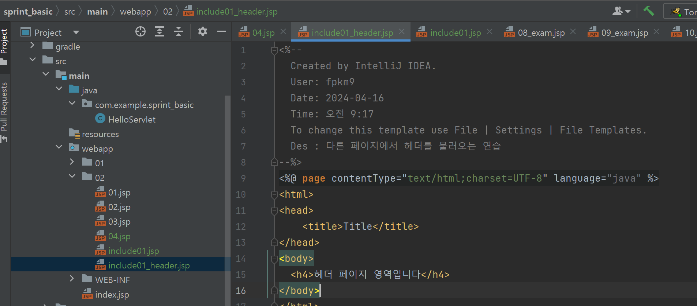

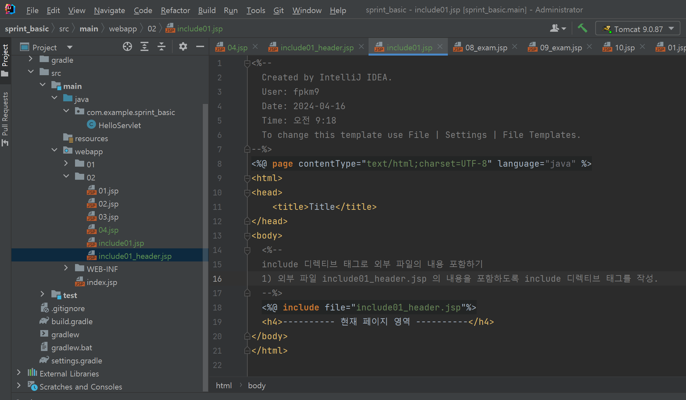

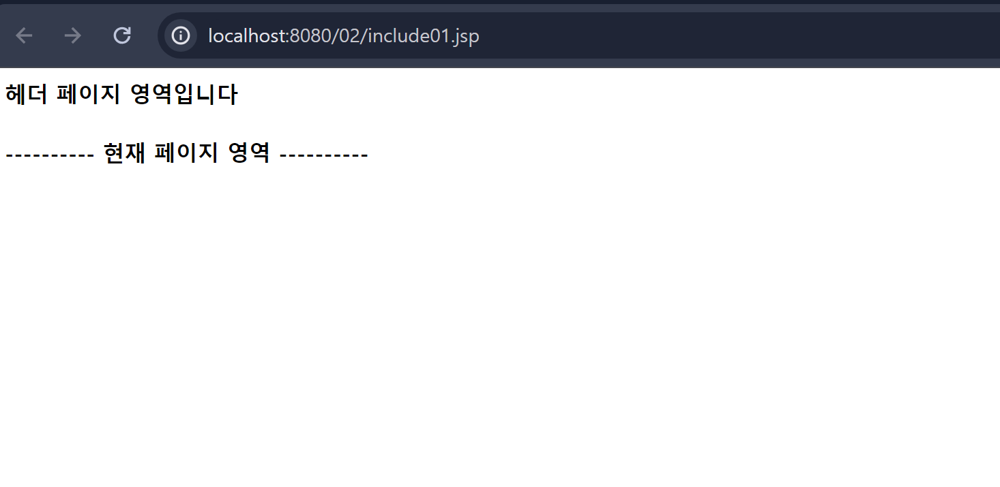


단점
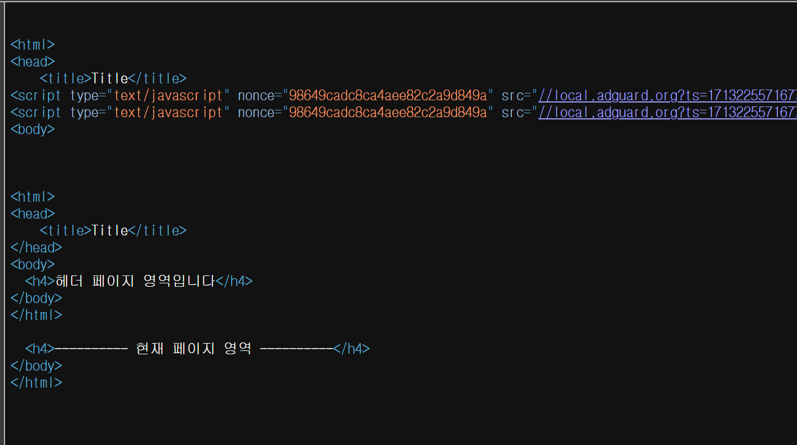

헤더영역이 2번 생성됨
그래서 include에 포함될 jsp는 쓸데없는 태그는 지워야 됨

연습
헤더, 푸터.jsp 파일을 만들고 `include`태그로 불러오기

`_header.jsp`
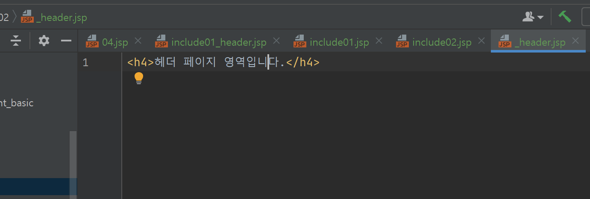
```html
<h4>헤더 페이지 영역입니다.</h4>
```

`_footer.jsp`
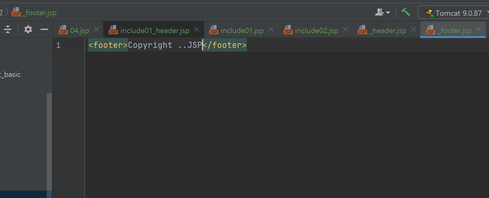
```html
<footer>Copyright ..JSP</footer>
```

`main.jsp`
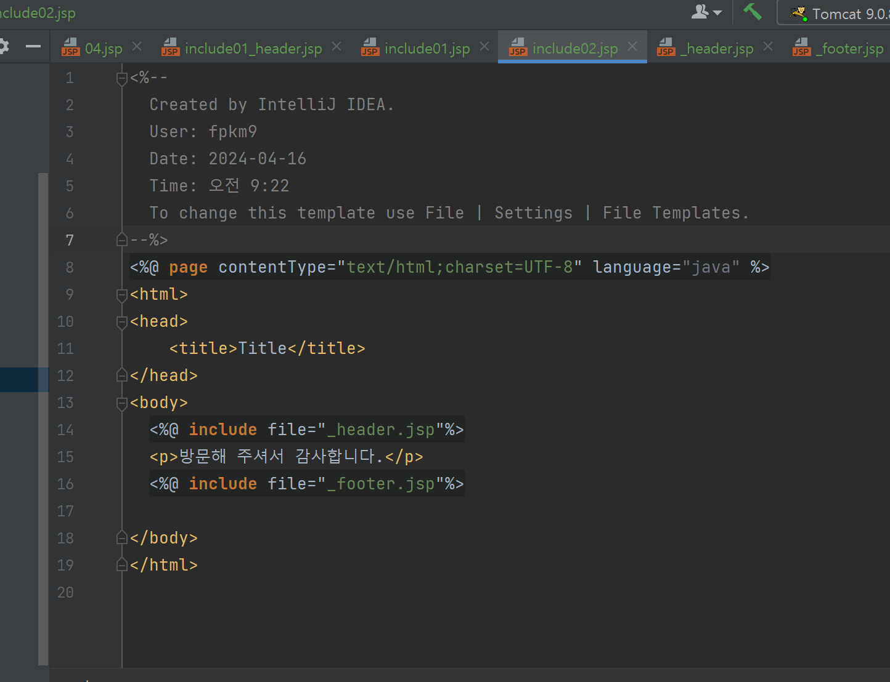

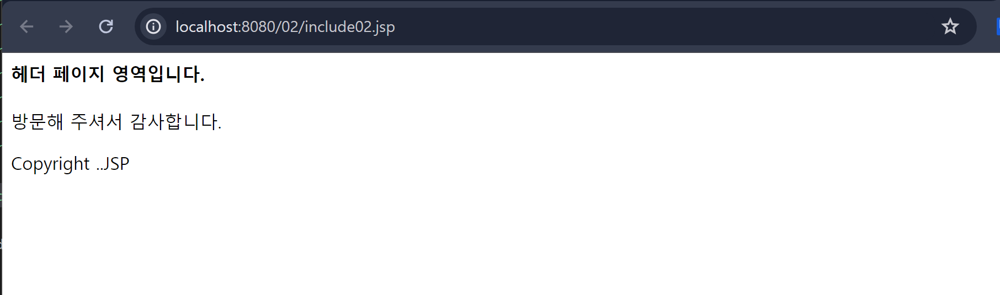

만약 한글이 깨진다면
1. 서버 설정에서 UTF-8로 설정
2. 깨지는 jsp 코드에 
`<%@ page contentType="text/html;charset=UTF-8" language="java" %>` 추가하기


헤더 영역 깨지는 경우
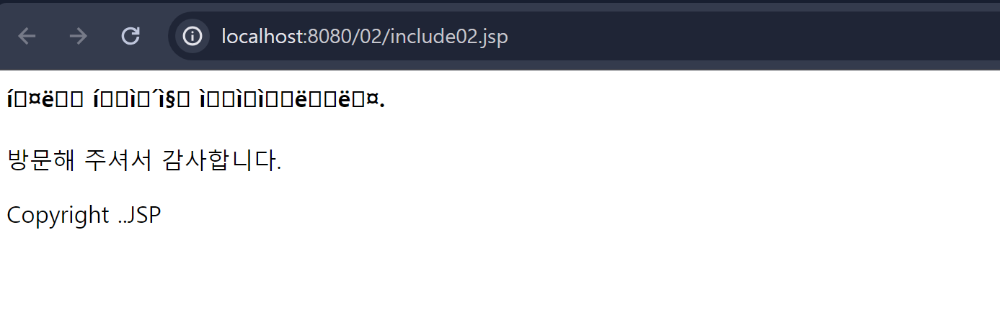
헤더페이지JSP파일에 UTF-8 타입 추가


의의
include 디렉티브를 사용하는 이유
- 공통된 부분을 별도의 JSP파일로 만들어 웹 페이지를 모듈화 할 수 있다.


---
### taglib 디렉티브 태그
`taglib` 디렉티브 태그는 주로 JSP(JavaServer Pages) 파일에서 사용되며, 사용자가 태그 라이브러리를 페이지에 가져오기 위해 사용합니다. 이를 통해 사용자는 표준 태그는 물론 사용자 정의 태그를 JSP 페이지에 쉽게 적용할 수 있습니다.

### 기본 구조
`taglib` 디렉티브는 다음과 같은 형식을 가집니다:
```jsp
<%@ taglib uri="라이브러리의URI" prefix="사용할접두어" %>
```
- `uri`: 태그 라이브러리의 위치를 식별합니다. 이는 태그 라이브러리의 특정한 URI나 URL일 수 있습니다.
- `prefix`: 해당 태그 라이브러리의 태그들을 JSP 페이지 내에서 사용할 때, 앞에 붙일 접두어입니다.

### 예제
예를 들어, JSTL 코어 태그 라이브러리를 사용하기 위해 다음과 같이 JSP 페이지에 추가할 수 있습니다:
```jsp
<%@ taglib uri="http://java.sun.com/jsp/jstl/core" prefix="c" %>
```
이렇게 설정하고 나면, `c` 접두어를 사용하여 JSTL 코어 라이브러리의 태그들을 호출할 수 있습니다. 예를 들어, 조건문 처리를 위한 `<c:if>` 태그를 사용할 수 있습니다:
```jsp
<c:if test="${condition}">
    <!-- 조건이 참일 때 수행할 내용 -->
</c:if>
```

`taglib` 디렉티브는 JSP 페이지에서 태그를 사용하기 위한 선언적 방법을 제공하며, 코드의 재사용성과 가독성을 높여줍니다.
문법


1. jstl 라이브러리

```html
<%@ page contentType="text/html;charset=UTF-8" language="java" %>
<%@ taglib prefix="c" uri="http://java.sun.com/jsp/jstl/core" %>

<html>
<head>
    <title>Title</title>
</head>
<body>
        <%--taglib 디렉티브 태그에 태그 라이브러리로 JSTL을 설정하는 예--%>
        <%--
        JSTL 태그
        유용한 JSP 태그의 모음인 JSTL은 자주 사용되는 핵심 기능을 제공.
        반복문, 조건문과 같은 논리적 구조 작업, XML 문서 조작, 국제화 태그 조직, SQL 조작 수행을 위한 태그를 지원.

        JTSL을 사용하려면 WebContent/WEB-INF/lib 디렉터리의 위치에 jstl.jar 라이브러리 파일이 있어야 함.
        Apache Standard Taglib 페이지에서 다운로드 가능.
        --%>
        <c:forEach var="k" begin="1" end="10" step="1">
            <c:out value="${k}" />
        </c:forEach>
</body>
</html>
```
`<%@ taglib prefix="c" uri="http://java.sun.com/jsp/jstl/core" %>`
가 빨간줄이 뜬다.


외부 라이브러리 가져오기

https://mvnrepository.com/

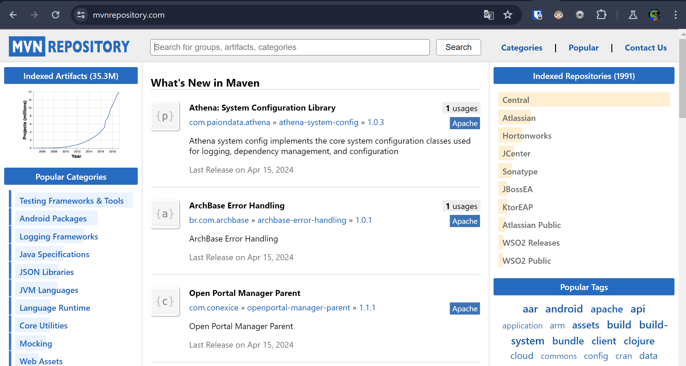

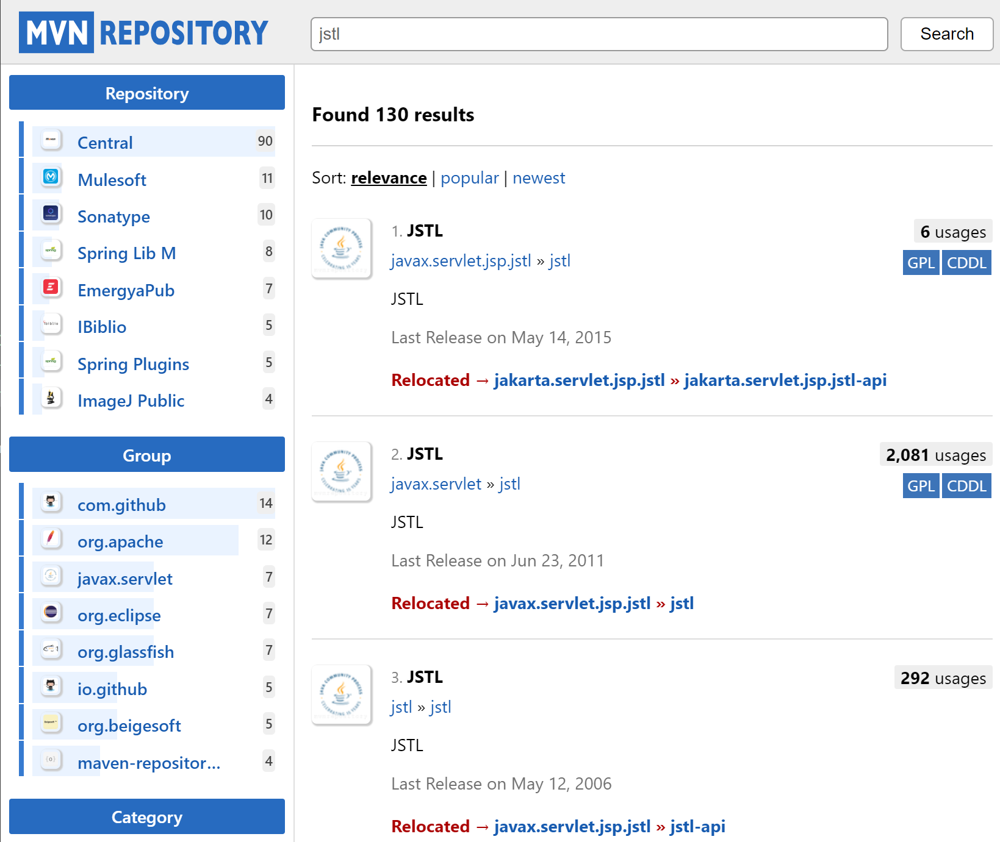


1.2 클릭
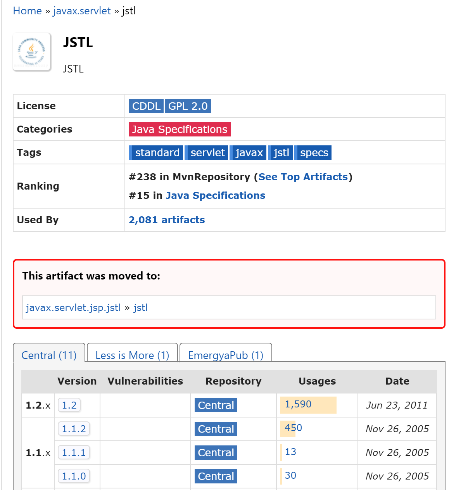

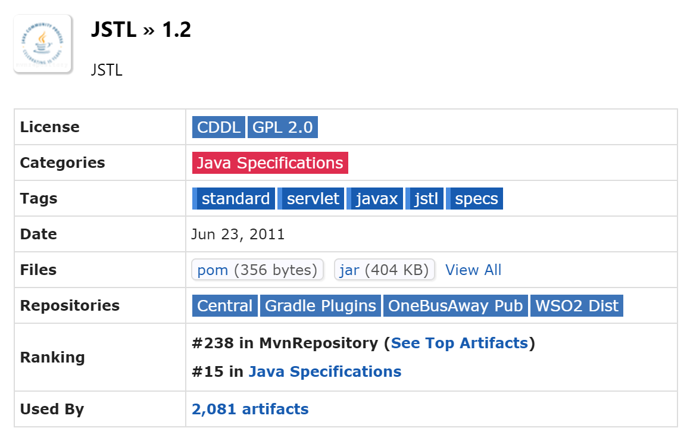

jar 파일을 다운받고 설치하는 등 여러가지 절차를 거쳐야 하는데
Gradle은 쉽다

중간에 Maven 선택되어있는것을 Gradle로 바꾸고 코드를 클릭
`built.gradle` 에 코드를 추가해주면 끝난다.


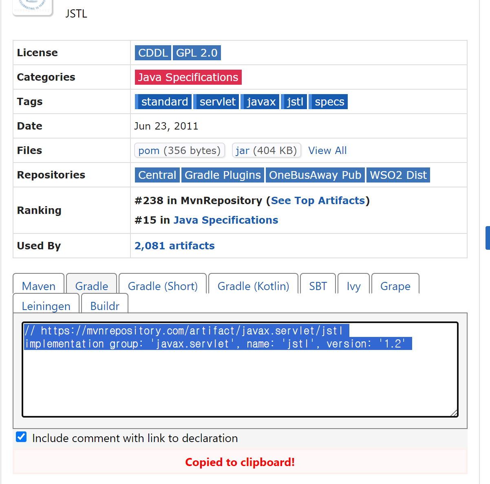


dependencies 에 복사된 코드를 붙여넣고 우측상단에 코끼리모양을 클릭해주자
그리고 
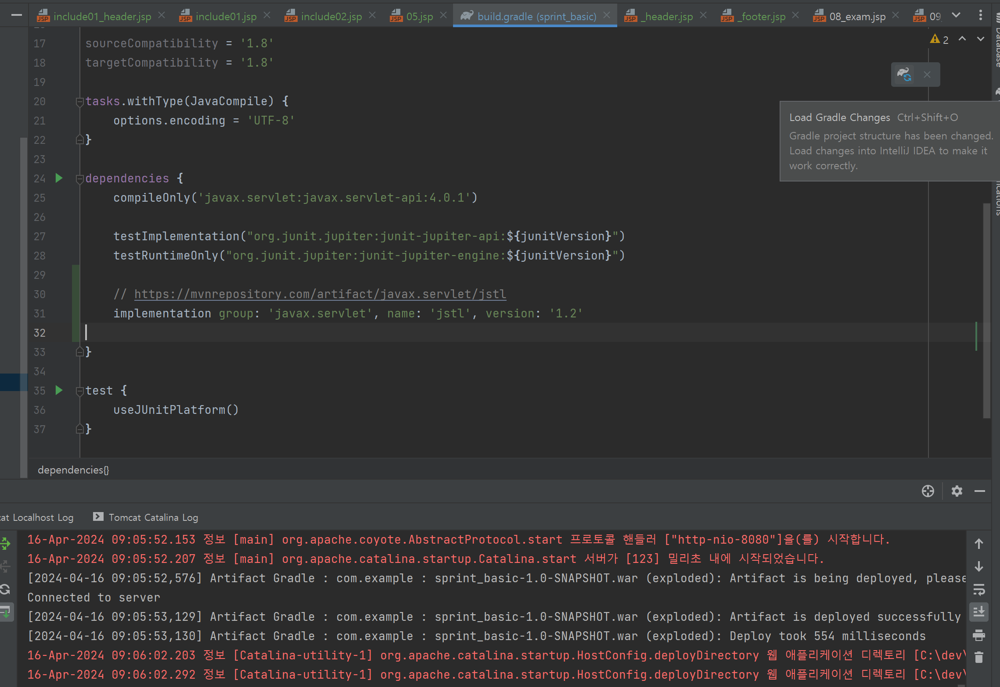

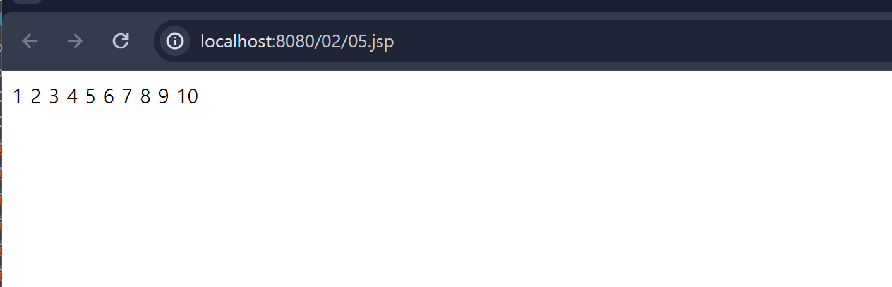


연습

`include.jsp`
```html
<%@ page import="java.util.Date" %><%--
  Created by IntelliJ IDEA.
  User: fpkm9
  Date: 2024-04-16
  Time: 오전 9:45
  To change this template use File | Settings | File Templates.
--%>
<%@ page contentType="text/html;charset=UTF-8" language="java" %>
<html>
<head>
    <title>Title</title>
</head>
<body>
  <%--
  2. page 디렉티브 태그를 이용하여 다음 조건에 맞게 JSP 애플리케이션을 만들고 실행 결과를 확인하시오.
  1) header.jsp 파일 생성
  <h4> 태그를 이용하여 Hello, Java Server Pages. 를 선언
  2) include.jsp 파일을 생성
  include 디렉티브 태그를 이용하여 외부파일 header.jsp 의 내용을 포함.
  java.util.Date 클래스를 이용하여 현재 시간을 출력
    --%>
  <%@ include file="_header.jsp"%>
  현재 시간 : <%= new Date()%>
</body>
</html>
```
`header.sjp`

```html
<%@ page contentType="text/html;charset=UTF-8" language="java" %>
<h4>Hello, Java Server Pages.</h4>
```


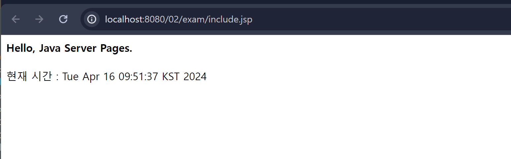


---
### 05. 내장 객체
`request`, `response` 사용법 숙지
JSP 페이지에서 사용할 수 있도록 JSP 컨테이너에 미리 정의된 객체.


속성처리 메소드의 종류 (자바스크립트와 유사)


핵심
1. request 내장 객체의 기능과 사용법
웹 브라우저에서 서버의 JSP 페이지로 전달하는 정보를 저장.(request)


https://velog.io/@yoonsik123/TIL-45-JSP-%EB%82%B4%EC%9E%A5-%EA%B0%9D%EC%B2%B4Implicit-Object


사용

`requests01_process.jsp`
```js
<%@ page contentType="text/html;charset=UTF-8" language="java" %>
<html>
<head>
    <title>Title</title>
</head>
<body>
  <%--
  request 내장 객체로 폼 페이지에서 아이디와 비밀번호를 전송 받아 출력하기.
  1) 폼 페이지에서 입력한 한글을 처리하도록 request 내장 객체의 setCharacterEncoding() 메서드에 문자 인코딩 유형을 utf-8로 작성.
  2) 입력된 아이디와 비밀번호를 폼 문으로 부터 전송받도록 request 내장 객체의 getParameter() 메서드를 작성.
  3) 폼 문으로부터 전송받은 아이디와 비밀번호를 출력하도록 표현문 태그를 작성.
  --%>
  <%
    request.setCharacterEncoding("utf-8");
    String userid = request.getParameter("id");
    String password = request.getParameter("passwd");
  %>
    <p> 아이디 : <%=userid%></p>
    <p> 비밀번호: <%=password%></p>

</body>
</html>
```
`01.jsp`
```js
<%@ page contentType="text/html;charset=UTF-8" language="java" %>
<html>
<head>
    <title>Title</title>
</head>
<body>
  <form action="request01_process.jsp" method="post">
      <p>아 이 디 : <input type="text" name="id">
      <p> 비밀번호: <input type="text" name="passwd">
      <p> <input type="submit" value="전송" />
  </form>
</body>
</html>
```

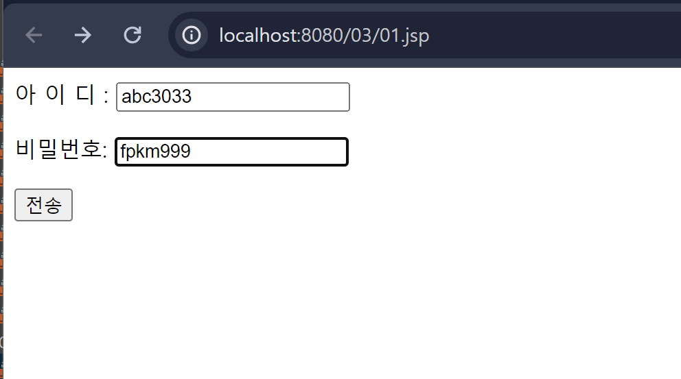

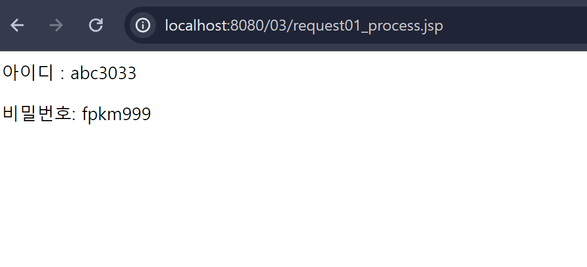


1) 요청 파라미터 관련 메소드
요청 파라미터는 사용자가 폼페이지에데이터를 입력한 후 서버에 전송할 때 전달되는 폼 페이지의 입력된 정보 형태.

2) request 내장 객체로 모든 HTTP 헤더 정보 값 출력하기.
        1) 모든 헤더 이름을 가져오도록 request 내장 객체의 getHeaderNames() 메서드를 호출하고,
        이를 모두 저장하도록 Enumeration 객체 타입의 변수 en을 작성.
        2) Enumeration 객체 타입 변수 en 의 hasMoreElements() 메서드를 통해 헤더 이름이 있을 때까지 반복하도록 while 문 작성.
        3) 현재 헤더 이름을 가져오도록 Enumeration 객체 타입 변수 en 의 nextElement() 메서드를 작성.
        4) 설정된 헤더 이름의 값을 가져오도록 request 내장 객체의 getHeader() 메소드를 작성.
```html
<%--
  Created by IntelliJ IDEA.
  User: fpkm9
  Date: 2024-04-16
  Time: 오전 10:09
  To change this template use File | Settings | File Templates.
--%>
<%@ page contentType="text/html;charset=UTF-8" language="java" %>
<html>
<head>
    <title>Title</title>
</head>
<body>  
  <form action="request01_process.jsp" method="post">
      <p>아 이 디 : <input type="text" name="id">
      <p> 비밀번호: <input type="text" name="passwd">
      <p> <input type="submit" value="전송" />
  </form>

</body>
</html>
```
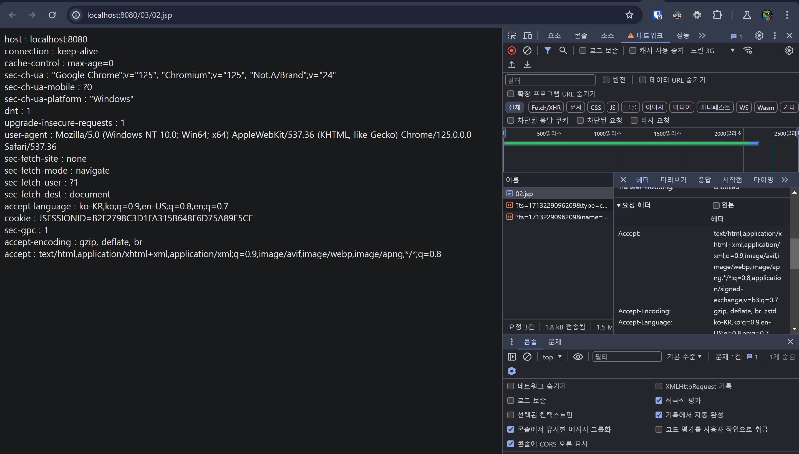

