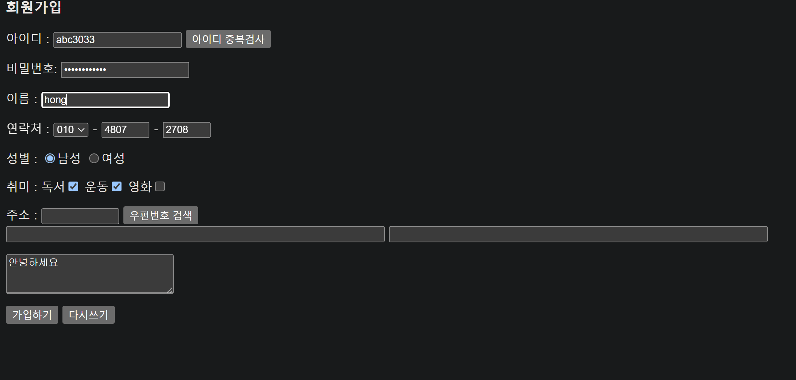
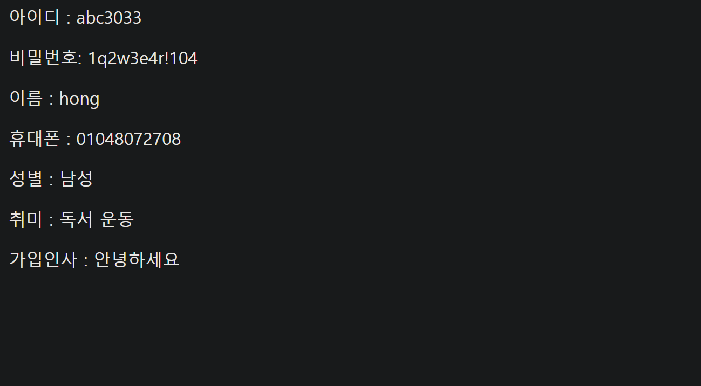
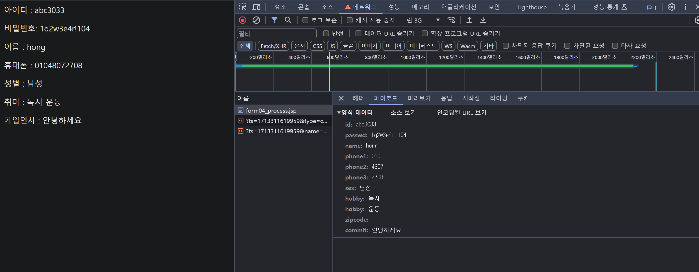
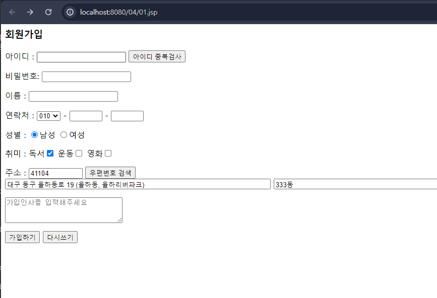
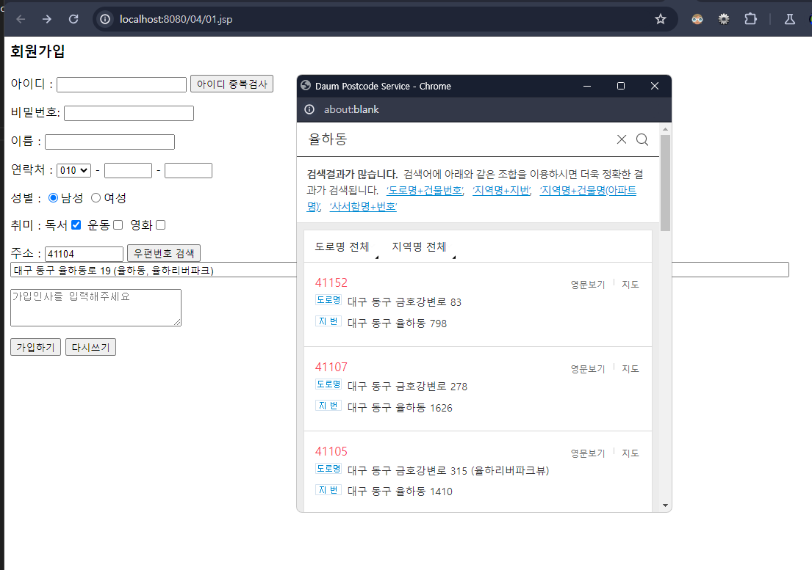
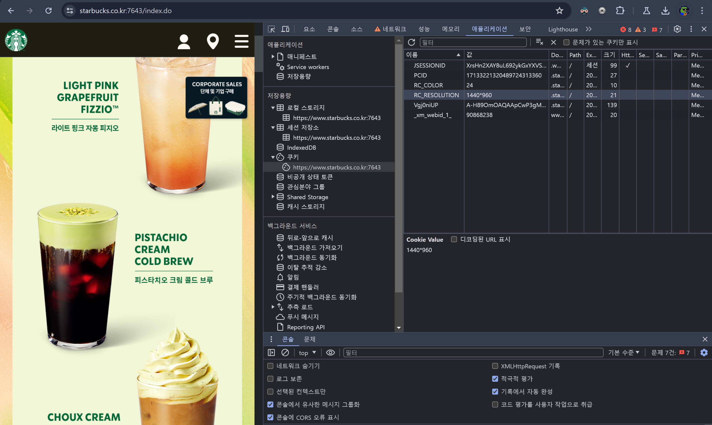
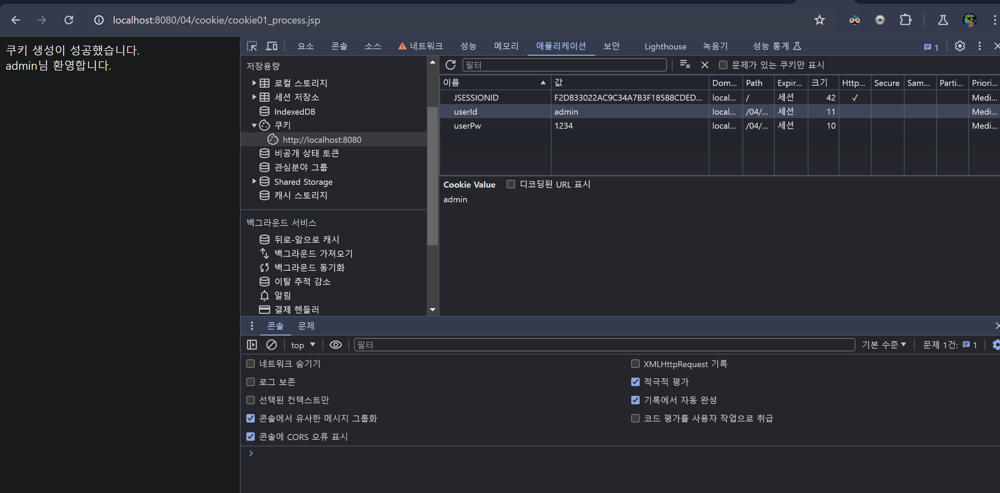
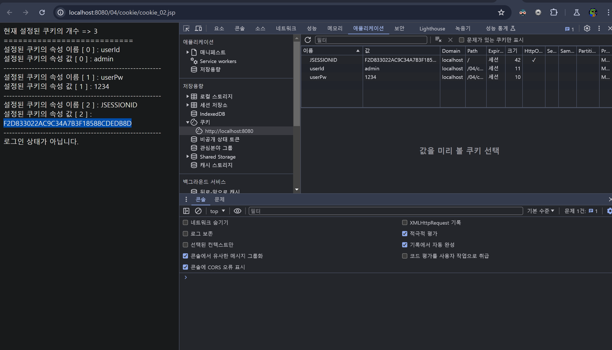
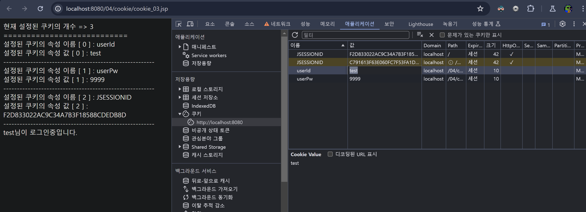

## 폼 태그 (`<form>`)
폼은 사용자가 웹 브라우저를 통해 입력한 모든 데이터를 서버로 전송하는 양식입니다.

### 폼 태그 처리 과정
자세한 처리 과정은 PDF 문서를 참조해주세요.

### `form` 태그의 속성
| 속성 | 내용 | 설명 |
|------|------|------|
| `action` | 서버의 URL | 폼 데이터가 전송될 서버의 URL을 지정 |
| `method` | GET, POST | 데이터 전송 방식을 지정 (GET 또는 POST) |
| `name` | 폼 이름 | 폼을 식별하기 위한 이름 |
| `target` | 결과 페이지의 표시 위치 | 폼을 전송한 후 결과를 표시할 방법을 지정 (예: `_blank`) |
| `enctype` | 데이터 인코딩 타입 | 데이터 인코딩 방식을 지정 (예: `multipart/form-data`는 파일 전송 시 사용) |

### GET 방식과 POST 방식의 차이
- **GET** 방식: URL에 데이터를 포함시켜 요청. 데이터가 URL에 노출되므로 보안에 취약하지만, 캐싱이나 북마크 저장이 가능.
- **POST** 방식: 데이터를 요청 본문에 포함시켜 전송. 데이터가 URL에 노출되지 않아 보안에 더 유리하며, 큰 데이터 전송이 가능.

## `input` 태그
`<input>` 태그는 사용자로부터 데이터를 입력 받기 위한 HTML 요소입니다.

### `input` 태그 종류
| 속성 | 속성값 | 설명 |
|------|--------|------|
| `type` | text, password 등 | 입력 받는 데이터의 타입을 지정 |
| `name` | 변수 이름 | 서버로 데이터를 전송할 때 사용할 이름 |
| `value` | 초기값 | 입력 필드의 초기 값 |
| `readonly` | readonly | 입력 필드를 읽기 전용으로 설정 |
| `disabled` | disabled | 입력 필드를 비활성화 |

### HTML5에서 추가된 `input` 태그 속성
| 속성 | 속성값 | 설명 |
|------|--------|------|
| `placeholder` | 텍스트 | 입력 필드에 표시할 가이드 텍스트 |
| `required` | required | 필드가 비어 있으면 폼 제출을 차단 |
| `pattern` | 정규 표현식 | 입력 값이 지정된 패턴에 맞는지 검사 |

### 예제 폼 - 사용자 등록 양식 (`01.jsp`)
목적:
- 새 사용자가 등록할 수 있는 인터페이스 제공.
- 다양한 사용자 정보를 폼 제출을 통해 수집.

특징:
1. 사용자 ID, 비밀번호, 이름, 연락처 정보 수집.
2. 전화번호 접두어를 선택하고 나머지 전화번호를 입력할 수 있는 드롭다운 및 입력 필드 제공.
3. 성별 선택과 여러 취미를 선택할 수 있는 체크박스 제공.
4. 우편번호 검색 기능 구현.
5. 등록 시 추가적인 댓글이나 인사말을 입력할 수 있는 텍스트 영역 제공.
6. 폼 제출 및 초기화 버튼 포함.

### 데이터 처리 및 표시 (`form04_process.jsp`)
목적:
- 등록 양식에서 받은 데이터 처리 및 입력된 정보 표시.


특징
1. 영어가 아닌 문자를 지원하기 위해 받은 양식 데이터를 UTF-8로 인코딩
2. 분리된 입력값에서 전체 전화번호를 구성합니다.
3. 사용자가 선택할 수 있는 여러 취미를 처리하고, 선택된 모든 취미를 표시합니다.
4. 사용자 ID, 비밀번호(일반적으로 권장되지 않음), 이름, 전화번호, 성별, 취미, 인사 메시지 등 제공된 모든 사용자 정보를 표시합니다.


`01.jsp`
```jsp
<%@ page contentType="text/html;charset=UTF-8" language="java" %>
<html>
<head>
    <title>Title</title>
</head>
<body>
<h3>회원가입</h3>
<form action="form04_process.jsp" name="member" method="post">
    <p> 아이디 : <input type="text" name="id"> <input type="button" value="아이디 중복검사"></p>
    <p> 비밀번호: <input type="password" name="passwd"></p>
    <p> 이름 : <input type="text" name="name"></p>
    <p> 연락처 : <select name="phone1">
        <option value="010">010</option>
        <option value="011">011</option>
        <option value="016">016</option>
        <option value="017">017</option>
        <option value="019">019</option>
    </select> - <input type="text" maxlength="4" size="4" name="phone2"> -
        <input type="text" maxlength="4" size="4" name="phone3"></p>
    <p> 성별 : <input type="radio" name="sex" value="남성" checked>남성
        <input type="radio" name="sex" value="여성">여성</p>
    <p> 취미 : 독서<input type="checkbox" name="hobby" value="독서" checked>
        운동<input type="checkbox" name="hobby" value="운동">
        영화<input type="checkbox" name="hobby" value="영화"></p>

    <p> 주소 : <input name="zipcode" id="zipcode" size="10" maxlength="7" readonly>
        <input type="button" value="우편번호 검색"><br />
        <input type="address01" id="address01" size="70" maxlength="70" readonly>
        <input type="address02" id="address02" size="70" maxlength="70"></p>

    <p><textarea name="commit" cols="30" rows="3" placeholder="가입인사를 입력해주세요"></textarea></p>
    <p><input type="submit" value="가입하기">
        <input type="reset" value="다시쓰기"></p>
</form>
</body>
</html>
```

`form04_process.jsp`

```jsp
<%@ page contentType="text/html;charset=UTF-8" language="java" %>
<html>
<head>
    <title>Title</title>
</head>
<body>
    <%
        request.setCharacterEncoding("utf-8");
        String userid = request.getParameter("id");
        String password = request.getParameter("passwd");

        String name = request.getParameter("name");

        String phone1 = request.getParameter("phone1");
        String phone2 = request.getParameter("phone2");
        String phone3 = request.getParameter("phone3");

        // 최종 저장되는 phone
        String phone = phone1 + phone2 + phone3;
        String sex = request.getParameter("sex");

        String[] hobby = request.getParameterValues("hobby");
//        String hobby1 = request.getParameter("hobby1");
//        String hobby2 = request.getParameter("hobby2");
//        String hobby3 = request.getParameter("hobby3");
        String commit = request.getParameter("commit");
        /*
          1. 아이디 중복 검사
          2. 휴대폰 번호 유효성 검사
          3. 취미 하나만 뽑아오기( 반환형이 Bool이므로 가능)
         */
    %>
    <p> 아이디 : <%=userid%></p>
    <p> 비밀번호: <%=password%></p>
    <p> 이름 : <%=name%></p>
    <p> 휴대폰 : <%=phone%></p>
    <p> 성별 : <%=sex%></p>
    <p> 취미 : <%
        if (hobby != null){
            for (String s: hobby) {
                out.println(" " + s);
            }
        }
        %></p>
    <p> 가입인사 : <%=commit%></p>
</body>
</html>
```

<p align="center">

</p>

<p align="center">

</p>

<p align="center">

</p>


---

도로명주소 기능 추가(카카오API)<br>
- https://postcode.map.daum.net/guide

```jsp
<%@ page contentType="text/html;charset=UTF-8" language="java" %>
<html>
<head>
    <title>Title</title>
</head>
<body>
<h3>회원가입</h3>
<form action="form04_process.jsp" name="member" method="post">
    <p> 아이디 : <input type="text" name="id"> <input type="button" value="아이디 중복검사"></p>
    <p> 비밀번호: <input type="password" name="passwd"></p>
    <p> 이름 : <input type="text" name="name"></p>
    <p> 연락처 : <select name="phone1">
        <option value="010">010</option>
        <option value="011">011</option>
        <option value="016">016</option>
        <option value="017">017</option>
        <option value="019">019</option>
    </select> - <input type="text" maxlength="4" size="4" name="phone2"> -
        <input type="text" maxlength="4" size="4" name="phone3"></p>
    <p> 성별 : <input type="radio" name="sex" value="남성" checked>남성
        <input type="radio" name="sex" value="여성">여성</p>
    <p> 취미 : 독서<input type="checkbox" name="hobby" value="독서" checked>
        운동<input type="checkbox" name="hobby" value="운동">
        영화<input type="checkbox" name="hobby" value="영화"></p>

    <p> 주소 : <input name="zipcode" id="zipcode" size="10" maxlength="7" readonly>
        <input type="button" onclick="execDaumPostcode()" value="우편번호 검색"><br/>
        <input name="address01" id="address01" size="70" maxlength="70" readonly>
        <input name="address02" id="address02" size="70" maxlength="70" placeholder="상세주소"></p>

    <p><textarea name="commit" cols="30" rows="3" placeholder="가입인사를 입력해주세요"></textarea></p>
    <p><input type="submit" value="가입하기">
        <input type="reset" value="다시쓰기"></p>
</form>
<script src="https://spi.maps.daum.net/imap/map_js_init/postcode.v2.js"></script>
<script>
    /*
     우편번호(도로명 주소)를 직접 DB로 받고 작업 하기엔에는 데이터가 너무 많아서 힘듬 
     그래서 카카오의 우편주소 서비스API를 이용하기로 함
     카카오 우편번호 서비스 api 특징
     key 발급 필요 없음
     사용량 제한 없음
     상업적 이용 무료
    
    카카오 우편번호 검색 가이드 페이지 :  https://postcode.map.daum.net/guide
    getElementById() : html 에서 매개변수로 받은 id 값이 있는 요소를 반환.
    */

    function execDaumPostcode() {
        new daum.Postcode({
            oncomplete: function (data) {
                // 팝업에서 검색결과 항목을 클릭했을때 실행할 코드를 작성하는 부분.

                // 각 주소의 노출 규칙에 따라 주소를 조합한다.
                // 내려오는 변수가 값이 없는 경우엔 공백('')값을 가지므로, 이를 참고하여 분기 한다.
                var fullAddr = ''; // 최종 주소 변수
                var extraAddr = ''; // 조합형 주소 변수

                // 사용자가 선택한 주소 타입에 따라 해당 주소 값을 가져온다.
                if (data.userSelectedType === 'R') { // 사용자가 도로명 주소를 선택했을 경우
                    fullAddr = data.roadAddress;
                } else { // 사용자가 지번 주소를 선택했을 경우(J)
                    fullAddr = data.jibunAddress;
                }

                // 사용자가 선택한 주소가 도로명 타입일때 조합한다.
                if (data.userSelectedType === 'R') {
                    //법정동명이 있을 경우 추가한다.
                    if (data.bname !== '') {
                        extraAddr += data.bname;
                    }
                    // 건물명이 있을 경우 추가한다.
                    if (data.buildingName !== '') {
                        extraAddr += (extraAddr !== '' ? ', ' + data.buildingName : data.buildingName);
                    }
                    // 조합형주소의 유무에 따라 양쪽에 괄호를 추가하여 최종 주소를 만든다.
                    fullAddr += (extraAddr !== '' ? ' (' + extraAddr + ')' : '');
                }

                // 우편번호와 주소 정보를 해당 필드에 넣는다.
                document.querySelector('input[name=zipcode]').value = data.zonecode; //5자리 새우편번호 사용
                document.querySelector('input[name=address01]').value = fullAddr;

                // 커서를 상세주소 필드로 이동한다.
                document.querySelector('input[name=address02]').focus();
            }
        }).open();
    }
</script>

</body>
</html>
```
`우편번호 검색`을 클릭하면 팝업으로 주소찾기 창이 나타난다.
거주지를 입력하고 클릭하면 해당 주소값이 아래의 입력필드에 저장

`input[name=zipcode]`, `nput[name=address01]`

<p align="center">

</p>

<p align="center">

</p>


---


## 유효성 검사 (Validation)
유효성 검사는 **사용자가 폼 페이지에서 입력한 데이터 값이 서버로 전송되기 전에 특정 규칙에 맞게 입력되었는지 검증하는 것**을 의미합니다.

### 유효성 검사 목록
다음은 웹 폼에서 흔히 수행되는 몇 가지 유효성 검사입니다:

- **Null 검사**: 입력 데이터가 `null`인지 확인합니다.
- **형식 검사**: 날짜나 이메일과 같은 입력이 특정 형식에 맞는지 확인합니다.
- **숫자 검사**: 나이 입력처럼 특정 입력이 숫자인지 확인합니다.
- **길이 검사**: 입력 데이터가 허용된 최대 길이를 초과하지 않았는지 확인합니다.
- 그 외에도 사용자 입력에 따른 다양한 조건을 검사할 수 있습니다.

### 데이터 길이 검사
데이터 길이 검사는 특정 입력 필드의 글자 수가 최소값과 최대값 사이에 있는지 확인합니다. 예를 들어, 사용자 이름이 1자 미만이거나 50자를 초과하지 않아야 할 경우, 이러한 조건을 검사하는 로직을 구현합니다.

### 데이터 유형 검사: 정규 표현식
데이터 유형 검사는 입력된 데이터가 특정 패턴 또는 데이터 유형에 부합하는지를 검사하기 위해 정규 표현식을 사용합니다. 정규 표현식은 매우 강력하며, 다음과 같은 상황에서 유용하게 활용될 수 있습니다:

- **데이터베이스 쿼리**: 안전한 입력을 보장하기 위해 사용자 입력을 정규 표현식으로 필터링할 수 있습니다.
- **폼 데이터 검증**: 이메일 주소, 전화번호, 사용자 ID 등 특정 형식을 요구하는 데이터의 유효성을 검사할 때 사용됩니다.

#### 정규 표현식의 딜레마
- **학습 곡선**: 정규 표현식은 강력하지만, 배우기가 어렵고 사용하지 않으면 쉽게 잊혀집니다.
- **효용성 대비 학습 비용**: 정규 표현식을 학습하는 데 드는 시간과 노력에 비해 실제 사용 빈도가 낮을 수 있으므로, 필요에 따라 적절한 사용이 중요합니다.


---
### 문제
유효성검사

아이디, 비밀번호 항목이 입력되지 않으면 '아이디(또는 비밀번호)를 입력해 주세요.' 라는 메시지 창이 뜨도록 작성

```jsp
<%@ page contentType="text/html;charset=UTF-8" language="java" %>
<html>
<head>
    <title>Title</title>
</head>

<body>
<form name="loginForm" action="validation01_process.jsp" method="post">
    <p> 아 이 디 : <input type="text" name="id">
    <p> 비밀번호 : <input type="text" name="passwd">
    <p><input type="button" value="전송"></p>
</form>
<script type="text/javascript">
    document.addEventListener('DOMContentLoaded', () => {
        const form = document.loginForm;
        const btn = document.querySelector('input[type=button]');
        btn.addEventListener('click', () => {

            if (form.id.value === '') {
                alert("아이디를 입력해주세요");
                form.id.focus();
                return;
            } else if (form.passwd.value === '') {
                alert("비밀번호를 입력해주세요");
                form.passwd.focus();
                return;
            } else if (form.passwd.value.indexOf(form.id.value) !== -1) {
                alert("비밀번호는 ID를 포함할 수 없습니다");
                form.passwd.focus();
                return;
            }
            form.submit();
        });
    });
</script>
</body>
</html>
```

```jsp
<%@ page contentType="text/html;charset=UTF-8" language="java" %>
<html>
<head>
    <title>Title</title>
</head>
<body>
<%
    String userid = request.getParameter("id");
    String password = request.getParameter("passwd");
%>
<p> 아이디 : <%=userid%>
</p>
<p> 비밀번호: <%=password%>
</p>
</body>
</html>
```


---
### 14. 쿠키
브랑줘(HTTP)는 기본적으로 서버에 계속 연결되는게 아니라 
필요한 경우에만 request를 요청하는 방식임.

브라우저입장에선 쿠키를 갖고 있는지 여부로 로그인 판단가능
그러나 쿠키는 클라이언트에 저장되기 떄문에 위변조 위험성떄문에 요즘엔 세션을 사용함

- 최근 사용용도

자동 로그인


브라우저에서 쿠키 정보를 확인

로그인을 하면 로그인 정보도 쿠키에 저장된다

---
### 쿠키 동작 과정
1. 쿠키 생성

- name-value 방식

2. 쿠키 저장
- 이건 브라우저가 알아서 쿠키를 저장함
`C:\Users\fpkm9\AppData\Local\Google\Chrome Dev\User Data\Default\Network\Cookies` 에 저장되어있음 
3. 쿠키 전송


---

### 쿠키 생성 실습

> 아이디,비밀번호를 검사 후 유효성이 검증되면 -> 쿠키를 생성 -> 생성된 쿠기를 브라우저에 전달
    
    쿠키 생성하기.
    1) 전송된 아이디와 비밀번호가 일치하면, 
    2) 쿠키 이름 userId, userPw 에 값을 설정하도록 Cookie 객체를 생성.
    

```jsp
<%@ page contentType="text/html;charset=UTF-8" language="java" %>
<html>
<head>
    <title>Title</title>
</head>
<body>
    <%
        String userId = request.getParameter("id");
        String userPw = request.getParameter("passwd");
        
        // 예전 방식임 <-- DB 안거치고 생성
        if (userId.equals("admin") && userPw.equals("1234")){ // 로그인 정보가 맞으면
            Cookie cookieId = new Cookie("userId",userId); // 쿠키 생성. Cookie 클래스를 이용해서 쿠키 객체 생성.
            Cookie cookiePw = new Cookie("userPw",userPw); 
            
            out.println("쿠키 생성이 성공했습니다.<br>"); // 
            out.println(userId + "님 환영합니다.");
        } else {
            out.println("쿠키 생성이 실패했습니다.");
        }
    %>

</body>
</html>
```

브라우저로 response

```jsp
<%@ page contentType="text/html;charset=UTF-8" language="java" %>
<html>
<head>
    <title>Title</title>
</head>
<body>
    <%--
    1. 쿠키 생성하기.
    1) 전송된 아이디와 비밀번호가 일치하면,
    크키 이름 userId, userPw 에 값을 설정하도록 Cookie 객체를 생성.
    --%>
    <%
        String userId = request.getParameter("id");
        String userPw = request.getParameter("passwd");

        // 예전 방식임 <-- DB 안거치고 생성
        if (userId.equals("admin") && userPw.equals("1234")){ // 로그인 정보가 맞으면
            Cookie cookieId = new Cookie("userId",userId); // 쿠키 생성. Cookie 클래스를 이용해서 쿠키 객체 생성.
            Cookie cookiePw = new Cookie("userPw",userPw);
            response.addCookie(cookieId); // response 할 때 쿠키도 같이 보낼 것.
            response.addCookie(cookiePw);
            out.println("쿠키 생성이 성공했습니다.<br>"); //
            out.println(userId + "님 환영합니다.");
        } else {
            out.println("쿠키 생성이 실패했습니다.");
        }
    %>

</body>
</html>
```




j세션으로 저장되어있다 -> 톰캣 사용한거다

---

## 쿠키 Cookie
쿠키(Cookie)는 웹 서버가 사용자의 브라우저에 저장하는 작은 데이터 조각<br>
이 데이터는 사용자가 동일한 웹 서버에 다시 액세스할 때마다 서버로 다시 전송됩니다. 쿠키는 주로 사용자의 세션 상태를 유지하는 데 사용되며, 웹 서비스의 사용성을 향상시키기 위해 널리 사용됩니다.

## 쿠키의 장단점

### 장점
1. **서버 부하 감소**: 사용자의 상태 정보를 클라이언트 측에서 유지함으로써 서버의 부하를 줄일 수 있습니다. 이는 세션 정보를 서버에 저장하는 대신 사용자의 브라우저에 저장하여 처리합니다.

### 단점
1. **보안 위험**: 쿠키는 사용자의 로컬 컴퓨터에 저장되기 때문에 개발자 도구를 통해 값의 확인 및 변경이 가능합니다. 이는 쿠키 데이터의 노출과 조작을 통한 보안 취약점을 야기할 수 있습니다.

## 쿠키 객체 정보 처리 방법

### 쿠키 객체 얻기

1. **쿠키 객체 얻기**: `request.getCookies()` 메서드를 사용하여 요청에 포함된 모든 쿠키를 얻을 수 있습니다. 이 메서드는 `Cookie[]` 객체를 반환합니다.
   
   ```jsp
   Cookie[] cookies = request.getCookies();
   ```

2. **쿠키 정보의 개수 출력**: 얻어온 쿠키 배열의 길이를 사용하여 쿠키의 수를 출력합니다.

   ```jsp
   if (cookies != null) {
       out.println("Number of cookies: " + cookies.length);
   }
   ```

3. **쿠키 이름과 값 출력**: 반복문을 사용하여 각 쿠키의 이름과 값을 출력합니다. `getName()` 메서드는 쿠키의 이름을, `getValue()` 메서드는 쿠키의 값을 반환합니다.

   ```jsp
   for (Cookie cookie : cookies) {
       out.println("Cookie Name: " + cookie.getName() + ", Value: " + cookie.getValue());
   }
   ```

### 쿠키 생성 및 설정 예시
쿠키를 생성하고 응답에 추가하는 방법은 다음과 같습니다:

```jsp
Cookie newCookie = new Cookie("user", "JohnDoe");
newCookie.setMaxAge(60*60*24); // 쿠키의 유효 시간을 24시간으로 설정
response.addCookie(newCookie);
```

위 코드는 "user"라는 이름의 쿠키를 생성하고, 해당 쿠키의 값으로 "JohnDoe"를 설정한 후, 유효 시간을 24시간으로 설정합니다. 이후 `response.addCookie(newCookie)`를 호출하여 생성한 쿠키를 클라이언트로 보냅니다.


소스

```jsp
<%@ page contentType="text/html;charset=UTF-8" language="java" %>
<html>
<head>
    <title>Title</title>
</head>
<body>
<%
    boolean isLogin = false;
    String userId = "";
    Cookie[] cookies = request.getCookies(); // request 에서 쿠키를 얻어옴.
    out.println("현재 설정된 쿠키의 개수 => " + cookies.length + "<br>");
    out.println("===========================<br>");

    for (int i = 0; i < cookies.length; i++) {
        out.println("설정된 쿠키의 속성 이름 [ " + i + " ] : " + cookies[i].getName() + "<br>");
        out.println("설정된 쿠키의 속성 값 [ " + i + " ] : " + cookies[i].getValue() + "<br>");
        out.println("--------------------------------------------------------<br>");

    }
    // 얻어온 쿠키 정보를 userId 와 검사하여 로그인 상태를 판단 배열로 저장했으니 for 쓰면 된다

    if (isLogin) {
        out.println(userId + "님이 로그인중입니다.");
    } else {
        out.println("로그인 상태가 아닙니다.");
    }
%>
</body>
</html>

```




이제 로그인이 했는지 안했는지 여부 로직 추가

쿠키 객체에 저장된 모든 쿠키 값 가져와서 출력하기
1) 쿠키 정보를 얻어오도록 request 내장 객체의 getCookies() 메서드 작성.
2) 얻어온 쿠키 정보의 개수를 출력하도록 Cookie 객체의 length 를 작성.
3) 얻어온 쿠키 정보에서 쿠키 이름과 값을 하나씩 출력하도록 Cookie 객체의 getName(), getvalue() 메서드 작성.

```jsp
<%@ page contentType="text/html;charset=UTF-8" language="java" %>
<html>
<head>
    <title>Title</title>
</head>
<body>

<%
    boolean isLogin = false;
    String userId = "";
    Cookie[] cookies = request.getCookies(); // request 에서 쿠키를 얻어옴.
    out.println("현재 설정된 쿠키의 개수 => " + cookies.length + "<br>");
    out.println("===========================<br>");
    for (int i = 0; i < cookies.length; i++) {
        out.println("설정된 쿠키의 속성 이름 [ " + i + " ] : " + cookies[i].getName() + "<br>");
        out.println("설정된 쿠키의 속성 값 [ " + i + " ] : " + cookies[i].getValue() + "<br>");
        out.println("--------------------------------------------------------<br>");

        if (cookies[i].getName().equals("userId") && cookies[i].getValue() != null) {
            // userId 라는 쿠키 이름이 있고 value 가 null 이 아니면 로그인 한 것으로 간주
            isLogin = true;
            userId = cookies[i].getValue();
        }
    }
    // 얻어온 쿠키 정보를 userId 와 검사하여 로그인 상태를 판단 배열로 저장했으니 for 쓰면 된다

    if (isLogin) {
        out.println(userId + "님이 로그인중입니다.");
    } else {
        out.println("로그인 상태가 아닙니다.");
    }
%>
</body>
</html>

```


로그인 state 여부도 가능해졌다
그러나
쿠키의 단점도 보이는데
값 수정을 해도 
